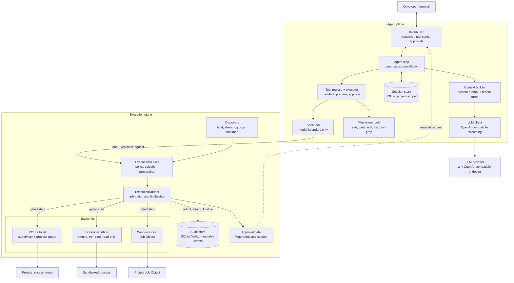

# TrueCoder

> A terminal coding agent with an auditable execution plane: every command it runs is policy-checked, approved, bounded, sandboxable, and durably recorded before a single byte of project code executes.

[](https://github.com/Shivam583-hue/TrueCoder/actions/workflows/tests.yml)
[](#prerequisites)
[](#available-commands-and-scripts)
[](#container-sandbox-image)
[](#testing)

TrueCoder is a Python agent runtime that reads, searches, edits, and runs code inside one project.
It ships a Textual terminal interface, an OpenAI-compatible LLM client, persistent SQLite sessions, eight approval-gated tools, a task planner, and an execution subsystem that treats running a command as a security event rather than a subprocess call.
Shell execution passes through policy evaluation, capability-based backend selection, an approval fingerprint, a durable audit admission, a resource launch gate, arbitrated terminal outcomes, and one immutable terminal audit record.
The certified sandbox profile runs commands in a digest-pinned, non-root, read-only, network-denied, capability-dropped Docker container that is proven against real Docker rather than assumed safe.

## Table of contents

- [Demo](#demo)
- [Key features](#key-features)
- [Repository structure](#repository-structure)
- [Engineering scorecard](#engineering-scorecard)
- [Technical highlights](#technical-highlights)
- [Architecture overview and diagram](#architecture-overview-and-diagram)
- [Technology stack](#technology-stack)
- [Prerequisites](#prerequisites)
- [Local development setup](#local-development-setup)
- [Environment variables](#environment-variables)
- [Container sandbox image](#container-sandbox-image)
- [Available commands and scripts](#available-commands-and-scripts)
- [Testing](#testing)
- [Runtime data and storage](#runtime-data-and-storage)
- [Known limitations](#known-limitations)
- [Contributing](#contributing)
- [Security](#security)
- [License](#license)

## Demo

Coming soon...

## Key features

- **Terminal-native agent** - a Textual TUI with streaming responses, live tool cards, inline approvals, cancellation, and token accounting.
- **Turn-based conversation model** - only complete, valid turns enter history, so a tool call never survives without its result.
- **Persistent project-scoped sessions** - completed turns are stored in SQLite outside the repository and restored transactionally, and one repository can never list or resume another repository's sessions.
- **Eight approval-gated tools** - `read_file`, `write_file`, `edit_file`, `list_dir`, `glob`, `grep`, `shell`, and `web_fetch`, each with its own validated schema and security boundary.
- **A task planner that survives context eviction** - `update_plan` keeps an ordered checklist with exactly one step in progress, and the current plan is reprojected into every model request instead of being left in history to roll off the token budget.
- **SSRF-resistant web access** - `web_fetch` allows only publicly routable addresses rather than blocking a list of bad ones, validates every DNS record before connecting, pins the connection to a validated address, and re-validates each redirect hop, so loopback, private ranges, and cloud metadata are refused by construction.
- **Fetched text is data, never instructions** - a page arrives with an explicit untrusted-content notice and prompt guidance that forbids following instructions found inside it.
- **Reviewable file mutations** - `write_file` and `edit_file` render a real unified diff in the approval card, with hunk headers, line numbers, and colored gutters, so a code change is reviewed as a diff rather than as escaped JSON arguments.
- **Durable mutation evidence** - every applied write and edit is recorded in its own immutable SQLite store with SHA-256 digests of the file before and after, byte counts, line deltas, and the originating call, turn, session, and workspace.
- **Atomic filesystem edits** - `write_file` and `edit_file` write beside the destination and install with `os.replace()`, so a reader sees the old complete file or the new complete file and never a partial one.
- **Concurrency-aware editing** - `edit_file` verifies device, inode, size, and modification time before replacement and reports `file_changed` instead of overwriting a file that moved underneath it.
- **Fingerprinted approvals** - approval covers canonical arguments, workspace identity, limits, backend, capabilities, risk, and policy version, so changing any of them requires approving again.
- **Policy-evaluated execution** - ordered rules classify read-only, test, build, package, network, deletion, permission, Git, script, and unknown commands, and requested limits can only tighten the configured ceiling.
- **Capability-matched backends** - discovery measures the real host, and selection compares every capability requirement independently instead of trusting optimistic class constants.
- **Proven container sandbox** - non-root UID 65532, read-only root filesystem, approved tmpfs only, denied network, all capabilities dropped, no-new-privileges, and a digest-pinned image that launch never pulls.
- **Durable execution audit** - a WAL-journaled SQLite evidence store with an immutable event log, trigger-protected rows, exactly one terminal outcome per run, and SHA-256 digests over the full raw output streams.
- **Operational evidence controls** - startup recovers nonterminal runs first, then atomically compacts expired terminal evidence while preserving schema triggers and every unresolved record.
- **Launch gating** - project-controlled code stays blocked behind a private gate until its exact backend resource identity is committed to the audit store.
- **Crash recovery** - startup leases every nonterminal audit row and acts only on exact persisted identities, never on a guessed or reused PID.
- **Bounded everything** - output, previews, environment allowlists, scan limits, match counts, and lifecycle event buffers all stay bounded as the underlying quantity grows.
- **Secret hygiene** - child environments are built from an allowlist rather than copied, credential-shaped names are removed, and values are never copied into audit metadata or tool results.
- **Live execution cards** - one evolving card per command, driven entirely by typed lifecycle stages, with bounded streaming output, responsive cancel by execution id, and the audit id on completion.
- **Actionable execution status** - refused and failed-start results carry bounded reason codes and messages, while `ctrl+e` explains audit, recovery, and backend health.
- **Compact approvals** - seven decision facts by default (command, directory, backend, access, limits, risk, scope), with the full capability contract behind the expander.
- **Safe shutdown** - closing the interface resolves any awaited approval, cancels active executions by id, and waits a bounded window for cleanup and audit finalization.
- **Cross-platform local execution** - POSIX process groups manage Linux and macOS commands, Windows Job Objects manage Windows process trees, and every native backend is exercised in CI on its own operating system.
- **Honest platform reporting** - unsupported capabilities remain explicit; for example, macOS reports `process_limits` as unsupported rather than applying a per-user rlimit as if it bounded a process tree.
- **Trusted-command rules** - versioned, user-editable rules that can only tighten policy, stored privately and parsed strictly.
- **Audit viewer** - filter runs by outcome, backend, recency, and text, with redacted secret-shaped details and cleanup status surfaced ahead of the exit code.
- **Project instructions** - `AGENTS.md` and `AGENTS.override.md` are discovered from the Git project root down to the launch directory and injected into the system prompt.

## Repository structure

TrueCoder is a single `src`-layout Python package.
Application code lives under `src/truecoder/`, the sandbox image is built from `container/`, and the test suite is split by the kind of guarantee each layer proves.

```text
TrueCoder/
├── .github/
│   └── workflows/
│       └── tests.yml                  # Linux, sandbox, macOS, and Windows CI matrix
├── .env.example                       # LLM provider template
├── .gitignore
├── AGENTS.md                          # Project instructions injected into the system prompt
├── README.md
├── pyproject.toml                     # Package metadata, dependencies, and the console script
│
├── container/                         # Execution sandbox image
│   ├── Dockerfile                     # Digest-pinned base, non-root UID 65532, trusted entrypoint
│   ├── entrypoint.py                  # In-container supervisor and CPU accounting
│   ├── image.lock                     # Pinned content digest, platform, user, entrypoint version
│   └── README.build.md                # Build, lock, verify, and rebuild policy
│
├── docs/
│   └── ARCHITECTURE.md                # Authoritative design reference and invariant list
│
├── src/truecoder/
│   ├── __main__.py                    # python -m truecoder
│   │
│   ├── agent/                         # Orchestration
│   │   ├── agent.py                   # Agent loop, tool invocation contexts, and app launch
│   │   ├── context.py                 # Turn-based context selection and token budgeting
│   │   ├── state.py                   # Active turn and completed history
│   │   ├── messages.py                # Durable model message types
│   │   ├── events.py                  # Agent event stream consumed by the UI
│   │   ├── approval.py                # Agent-side approval routing
│   │   ├── prompts.py                 # System prompt and conditional tool guidance
│   │   └── project_instructions.py    # Project root discovery and AGENTS.md loading
│   │
│   ├── planning/                      # Dependency-free task plan domain
│   │   ├── models.py                  # Plan and step invariants, bounds, and rendering
│   │   └── store.py                   # The single in-memory plan for the active task
│   │
│   ├── web/                           # Outbound network boundary
│   │   ├── policy.py                  # Scheme, host, and public-address rules
│   │   ├── fetch.py                   # Pinned, redirect-checked, bounded client
│   │   └── extract.py                 # Markup to readable text, pre-blocks kept
│   │
│   ├── mutation/                      # Dependency-free file-change domain
│   │   ├── models.py                  # Hunks, lines, and bounded diff limits
│   │   └── diff.py                    # Pure unified diff with context and truncation
│   │
│   ├── client/
│   │   ├── llm_client.py              # OpenAI-compatible streaming and non-streaming calls
│   │   └── response.py                # Provider responses translated into internal events
│   │
│   ├── tools/
│   │   ├── base.py                    # Tool definitions, arguments, calls, and results
│   │   ├── context.py                 # ToolInvocationContext bound to call, turn, and session
│   │   ├── executor.py                # Validate, prepare once, approve, then execute
│   │   ├── registry.py                # Explicit registration and lookup
│   │   ├── serialization.py           # Deterministic tool payloads
│   │   ├── mutation_audit.py          # Immutable evidence for every applied change
│   │   └── builtin/
│   │       ├── filesystem.py          # Shared sensitive-path and containment policy
│   │       ├── read_file.py           # Bounded UTF-8 line ranges
│   │       ├── write_file.py          # Atomic replacement, 32 KiB cap, diff preview
│   │       ├── edit_file.py           # Exact-text edits with concurrent-change detection
│   │       ├── list_dir.py            # Immediate children, 500 results, 5,000 scanned
│   │       ├── glob.py                # Rooted * and recursive ** path patterns
│   │       ├── grep.py                # Regex search with 200 matches and 20,000 scanned
│   │       ├── plan.py                # Whole-list plan replacement, no approval needed
│   │       ├── web_fetch.py           # One public page as bounded readable text
│   │       └── shell.py               # Model boundary for execution, not an executor
│   │
│   ├── execution/                     # Execution control plane
│   │   ├── models.py                  # Requests, limits, capabilities, contexts, results
│   │   ├── errors.py                  # Typed infrastructure and compatibility failures
│   │   ├── serialization.py           # Versioned execution-domain JSON envelopes
│   │   ├── context.py                 # Execution identity and workspace hashing
│   │   ├── cancellation.py            # Source and read-only token split
│   │   ├── clock.py                   # Injectable wall and monotonic time boundary
│   │   ├── configuration.py           # Optional strict operator policy; defaults need no setup
│   │   ├── registry.py                # Opaque execution ID to active entry
│   │   ├── policy.py                  # Ordered classification, limits, risk, and reasons
│   │   ├── environment.py             # Allowlist child environments and secret removal
│   │   ├── output.py                  # Bounded byte streams, decoding, sanitizing, redaction
│   │   ├── discovery.py               # Host, shell, cgroup, runtime, and image facts
│   │   ├── selection.py               # Pure capability matching and backend choice
│   │   ├── preparation.py             # One PreparedExecution no backend may re-derive
│   │   ├── lifecycle.py               # Validated internal state machine
│   │   ├── runner.py                  # Admission to one arbitrated terminal outcome
│   │   ├── results.py                 # Terminal material to audit and public result
│   │   ├── service.py                 # Public execute, cancel, and lookup surface
│   │   ├── approval.py                # Execution approval gate and safe-scope rules
│   │   ├── events.py                  # Bounded transient lifecycle publishing
│   │   ├── bootstrap.py               # Composition root and health report
│   │   ├── defaults.py                # Default limits: 120 s, 1 MiB output, 64 KiB return
│   │   ├── trusted_rules.py           # Versioned trusted-command rules that only tighten
│   │   │
│   │   ├── audit/                     # Durable evidence boundary
│   │   │   ├── schema.py              # Versioned SQLite schema and immutability triggers
│   │   │   ├── store.py               # WAL, immediate transactions, atomic finalization
│   │   │   ├── service.py             # Admission, events, attachment, finalization
│   │   │   ├── permissions.py         # 0700 directories and 0600 files, or unavailable
│   │   │   ├── output.py              # Hashed full streams with bounded previews
│   │   │   ├── recovery.py            # Leasing and terminal closure of nonterminal rows
│   │   │   ├── retention.py           # Cutoff policy for atomic terminal-evidence compaction
│   │   │   ├── models.py
│   │   │   └── codec.py
│   │   │
│   │   └── backends/
│   │       ├── base.py                # Shared backend and handle protocol
│   │       ├── models.py              # Descriptors, snapshots, resource identifiers
│   │       ├── registry.py            # get_exact refuses descriptor drift
│   │       ├── posix.py               # Linux and macOS local process backend
│   │       ├── posix_supervisor.py    # Session leader, gated project group, lifetime pipe
│   │       ├── posix_protocol.py      # Versioned length-prefixed JSON frames
│   │       ├── posix_plan.py          # Pure exec and shell launch planning
│   │       ├── posix_cgroup.py        # Delegated cgroup v2 subtree handling
│   │       ├── posix_limits.py        # cgroup hard limits and rlimit fallbacks
│   │       ├── posix_platform.py      # Honest Linux and macOS capability differences
│   │       ├── posix_identity.py      # Host, boot ID, and start-tick identity
│   │       ├── posix_recovery.py      # Exact-match-only recovery
│   │       ├── container.py           # Create, register, then start
│   │       ├── container_models.py    # Typed mounts, labels, image, and launch plans
│   │       ├── container_plan.py      # Pure mounts, labels, limits, and argv
│   │       ├── container_dialects.py  # Docker dialect only, by design
│   │       ├── container_runtime.py   # Runtime invocation boundary
│   │       ├── container_identity.py  # Label and ownership verification
│   │       ├── container_recovery.py  # Full immutable ID plus exact label match
│   │       ├── windows.py             # Job Object backend, handle, and recovery
│   │       ├── windows_native.py      # ctypes Win32 boundary, suspended launch gate
│   │       └── windows_plan.py        # Pure argv, quoting, and error normalization
│   │
│   ├── session/
│   │   ├── manager.py                 # Create, switch, rename, delete, and append turns
│   │   ├── store.py                   # Project-scoped SQLite in the user data directory
│   │   ├── codec.py                   # Validated encode and decode of durable turns
│   │   └── models.py
│   │
│   └── tui/
│       ├── app.py                     # Textual application, mount-time execution bootstrap
│       ├── execution_view.py          # Pure stage mapping, approval rows, bounded preview
│       ├── audit_view.py              # Workspace audit browser and bounded detail view
│       ├── execution_health.py        # Audit, recovery, and backend status screen
│       ├── widgets.py                 # Transcript, tool cards, plan card, and approvals
│       ├── sessions.py                # Session browser
│       └── styles.tcss                # Terminal stylesheet
│
└── tests/
    ├── unit/                          # Mostly pure logic and injected platform fixtures
    │   ├── agent/                     # Loop, state, messages, composition, instructions
    │   ├── client/                    # Streaming, retries, and error translation
    │   ├── context/                   # Turn selection, token budgeting, plan projection
    │   ├── planning/                  # Plan and step invariants
    │   ├── mutation/                  # Diff hunks, bounds, and truncation
    │   ├── web/                       # URL policy, SSRF refusals, extraction
    │   ├── session/                   # Durable turn codec
    │   ├── tools/                     # Base, executor, registry, and every builtin tool
    │   ├── tui/                       # Presentation mapping, cards, and audit summaries
    │   └── execution/                 # Policy, environment, output, discovery, selection
    │       └── audit/                 # Store, permissions, recovery, and evidence
    ├── contract/                      # 41 scenarios: one contract, four backend adapters
    │   └── execution/
    │       ├── backend_contract.py
    │       ├── test_fake_backend_contract.py
    │       ├── test_posix_backend_contract.py
    │       ├── test_container_backend_contract.py
    │       └── test_windows_backend_contract.py
    ├── integration/                   # Real processes, SQLite, native Windows, and the TUI
    │   ├── execution/
    │   │   └── backends/
    │   │       └── test_windows_backend.py # Job cleanup, process limits, service audit
    │   ├── session/
    │   └── tui/
    ├── sandbox/                       # Adversarial checks against real Docker
    ├── fakes/                         # Deterministic backend and service doubles
    └── helpers/                       # Real child programs, including Windows Job probes
```

### Where to make common changes

| Change                                | Primary location                                  | Usually also check                                                     |
| ------------------------------------- | ------------------------------------------------- | ---------------------------------------------------------------------- |
| Terminal UI, transcript, or approvals | `src/truecoder/tui`                               | `styles.tcss`, agent events, and the TUI integration tests             |
| Agent loop or turn lifecycle          | `src/truecoder/agent/agent.py` and `state.py`     | Context builder, session codec, and unit agent tests                   |
| Provider behavior                     | `src/truecoder/client`                            | `response.py` event translation and client unit tests                  |
| A new tool                            | `src/truecoder/tools/builtin`                     | `builtin/__init__.py`, registration in `agent.py`, and tool tests      |
| Plan shape or invariants              | `src/truecoder/planning`                          | `builtin/plan.py`, `PlanCard`, plan projection in `context.py`         |
| Outbound network rules                | `src/truecoder/web/policy.py`                     | `fetch.py` redirect handling and the SSRF refusal tests                |
| Diff rendering or bounds              | `src/truecoder/mutation`                          | `ToolCallCard` diff view, `styles.tcss`, preview tests                 |
| Mutation evidence                     | `src/truecoder/tools/mutation_audit.py`           | `write_file.py`, `edit_file.py`, and the schema immutability triggers  |
| Filesystem safety rules               | `src/truecoder/tools/builtin/filesystem.py`       | Every filesystem tool and its sensitive-path tests                     |
| Command classification or limits      | `src/truecoder/execution/policy.py`               | `defaults.py`, approval display, and policy unit tests                 |
| Host detection                        | `src/truecoder/execution/discovery.py`            | `selection.py`, `bootstrap.py`, and discovery integration tests        |
| Process lifecycle on POSIX            | `src/truecoder/execution/backends/posix*.py`      | The backend contract suite and POSIX integration tests                 |
| Process lifecycle on Windows          | `src/truecoder/execution/backends/windows*.py`    | Native contract and integration suites on `windows-latest`             |
| Sandbox flags or mounts               | `src/truecoder/execution/backends/container_plan` | `container_dialects.py`, `image.lock`, and the sandbox suite           |
| Audit schema or evidence              | `src/truecoder/execution/audit`                   | `schema.py` version, recovery handlers, and audit store tests          |
| Operator execution policy             | `src/truecoder/execution/configuration.py`        | Defaults, bootstrap, trusted rules, health, and configuration tests    |
| Startup wiring                        | `src/truecoder/execution/bootstrap.py`            | Health report, `prompts.py` shell guidance, and composition tests      |
| Sandbox image                         | `container/`                                      | `container/image.lock` in the same commit, then rerun the sandbox suite |

Dependencies point toward the core.
Tools never depend on the agent, client, or UI, and the UI never contains agent logic.

## Engineering scorecard

Local figures below were measured on 6 August 2026 from this working tree, on Linux with Python 3.14.3 and Docker 29.3.0.
Cross-platform behavior is exercised by the GitHub Actions matrix on Linux, macOS, and Windows.

| Signal                     |                                   Current value | Scope and interpretation                                                                                                                                     |
| -------------------------- | ----------------------------------------------: | ------------------------------------------------------------------------------------------------------------------------------------------------------------ |
| Physical source lines      |                      **29,589** across 110 files | Python under `src/truecoder`, excluding tests, the sandbox image, and generated packaging metadata.                                                           |
| Execution subsystem share  |                    **19,443 lines**, 66% of src | The execution control plane, audit store, and platform backends. Tools are 3,463 lines, the TUI is 2,974, the agent is 1,667, web is 653, sessions are 518, the client is 440, mutation is 281, and planning is 146. |
| Test lines                 |                      **28,080** across 138 files | The complete Python test tree, including fakes and child-process helpers; a test-to-source ratio of roughly 0.95 to 1.                                       |
| Automated scenarios        |                      **1,289**, locally clean   | 1,124 unit, 102 integration, 41 contract, and 22 sandbox scenarios. On Linux, 1,276 pass and 13 Windows-only scenarios skip.                                 |
| Unit suite                 |                  **1,124 passing in 4.2 seconds** | Mostly pure logic with injected boundaries; platform-specific filesystem and native-boundary cases are explicitly scoped to their supported hosts.           |
| Backend contract suite     |                      **41 scenarios**, 4 adapters | One reusable contract applied to fake, POSIX, container, and Windows Job Object backends. Linux runs 31 and skips the 10 Windows-host scenarios.              |
| Adversarial sandbox suite  |                                 **22 passing** | Run against real Docker: host secret unreadable, read-only enforcement, network denial, capability drop, memory, PID, and CPU limits, and no container or file leaks. |
| Lint                       |                          **ruff check clean** | ruff 0.16.0 over `src`, `tests`, and `container`.                                                                                                            |
| Certified sandbox profile  |         **Linux + Docker + one pinned image** | Podman and nerdctl are refused until their dialects pass the same tests. Non-Linux hosts report `container-platform-unsupported`.                             |
| Default execution ceiling  | **120 s, 1 MiB produced, 64 KiB returned** | Requests may tighten these values and can never widen them.                                                                                                  |
| Windows support            |                **Native contract + integration** | The `windows-latest` job exercises real Job Object output, termination, descendant cleanup, process limits, and durable service timeout finalization.          |
| Fuzz scenarios             |               **10, deterministic seed** | Noisy Unicode and structural input driven through the terminal sanitizer, bounded byte stream, bounded preview, trusted-rules parser, and Windows quoter.     |
| Continuous integration     |                   **4-platform job matrix** | Linux, adversarial Linux sandbox, macOS, and Windows jobs run the suites appropriate to their native boundaries.                                               |
| Coverage percentage        |                        **Not measured** | No coverage tool is committed or installed. No coverage number is claimed until one is.                                                                       |

## Technical highlights

- **Execution is admitted, not invoked.** `AuditService.admit()` must commit a pending run and its first event to SQLite before any backend is authorized to start. If permissions, schema verification, or the write fail, admission raises and nothing runs.
- **The launch gate is real.** The POSIX supervisor forks the project leader and blocks it on a private pipe before reporting readiness, which makes the process group ID available for the durable resource identifier. `START` is sent only after audit attachment commits. The container backend does the same with create, register, then start.
- **Terminal outcomes are arbitrated, never inferred.** `asyncio.wait` can return several completed signals at once, so every completed watcher becomes a candidate claim and is ranked by fixed priority: natural exit, output limit, resource limit, cancellation, then timeout. A command that exits exactly at its deadline is never mislabelled as a timeout.
- **The first claim wins forever.** `TerminalArbiter` records one winner, and a late cancellation receives the original claim instead of replacing it.
- **One owner reads the output.** A single output task reads each raw byte once and accounts for it twice: the collector hashes and counts the exact bytes for audit evidence, and the same update produces bounded sanitized text for the interface. Digests always cover the raw stream, never the redacted preview.
- **Timeouts and safety deadlines are different things.** The request timeout is a user-visible outcome. The short internal deadline used while waiting for a broken backend is an infrastructure failure and is reported as one, and output that cannot reach EOF within it marks the evidence incomplete rather than complete.
- **Failure withholds results.** A finalization failure returns no result and leaves a nonterminal row for recovery. Incomplete cleanup records `cleanup_failed` over the real command outcome instead of reporting success.
- **Approval cannot be widened by the UI.** The safe-scope calculation is authoritative, shell requests permit approve-once only, and the approval service rejects a handler response that selects a scope outside the request's allowed set.
- **Trusted rules only restrict.** They match structured executable names after base classification, may force approval, and deny commands above their risk ceiling. They never lower risk, remove approval, widen capabilities, or increase limits.
- **No backend re-derives anything.** `PreparedExecution` carries the effective request, selected descriptor, constructed environment, and resolved shell, and `BackendRegistry.get_exact` refuses a backend whose current descriptor has drifted from the prepared one.
- **Recovery never trusts a PID.** POSIX identity includes supervisor PID, project PGID, host identity, Linux boot ID, process start ticks, protocol version, and ownership token. Container recovery requires the full immutable container ID plus exact management, run, execution, ownership, host, and protocol labels. Windows binds a Job Object handle to the owning TrueCoder process and refuses to reuse that numeric handle after a restart.
- **Discovery does not guess.** Version probes use fixed argument vectors with no shell, short timeouts, bounded output, and a minimal environment, and a mounted cgroup filesystem is never confused with a writable delegated subtree.
- **The image is pinned by content digest.** Launch uses `--pull never`, and discovery verifies platform, non-root user, and entrypoint labels against `container/image.lock` before the container backend reports itself available.
- **Cancellation is addressable from admission.** The active control entry is registered right after durable admission and before approval is awaited, so an execution can be cancelled by ID for its whole life. Pre-start cancellation records `failed_to_start` with a `cancelled_before_start` detail because the command genuinely never ran.
- **Outer cancellation waits for cleanup.** If the agent task is cancelled, the agent signals the execution's cancellation source, shields the tool task, and waits for termination, cleanup, and audit finalization before propagating.
- **`shell` is advertised conditionally.** Audit failure, discovery failure, recovery failure, or no registered backend leaves `shell` out of the model schema entirely, and the shell-specific prompt guidance exists only while the tool is registered.
- **Retention preserves the evidence model.** Startup recovers unresolved runs first, then rebuilds and atomically replaces the audit database without expired terminal rows. Nonterminal rows and immutability triggers always survive.
- **Failure is explainable without leaking internals.** Ordinary refusals return stable reason codes and bounded corrective messages; the health screen shows why shell or a backend is unavailable, while arbitrary native diagnostics stay out of model-visible results.
- **Normal failure is data, not an exception.** Nonzero exits, policy denial, approval rejection, timeout, cancellation, limit termination, and backend unavailability are all bounded successful tool payloads. Only audit and cleanup failures become sanitized infrastructure errors.

## Architecture overview and diagram

TrueCoder separates an **agent plane** that decides what to do from an **execution plane** that decides whether and how it may happen.
The agent plane owns the loop, context, tools, and presentation.
The execution plane owns policy, approval, evidence, isolation, and process ownership.
The shell tool is the only bridge between them, and it is a thin adapter that converts arguments and formats results.



### Turn lifecycle

```text
user message
→ start active turn
→ build context: system prompt + recent complete turns + full active turn
→ call model
→ collect text and tool calls
→ prepare each call once, approve, execute, record results in order
→ call model again after every tool batch resolves
→ commit the complete pending group as one turn
→ append to the session store
```

Only complete turns enter history.
Interrupted or invalid turns are discarded rather than partially persisted.

### Execution lifecycle

```text
admission (durable)
→ policy evaluation
→ backend selection and exact preparation
→ approval
→ active registration
→ resource-gated backend start
→ supervision, arbitration, drain
→ termination and cleanup
→ one immutable terminal finalization
```

Policy denial, approval rejection, and backend unavailability all still reach one durable terminal row.
No route escapes audit.

## Technology stack

| Layer               | Technology                                  | Responsibility                                                        |
| ------------------- | ------------------------------------------- | --------------------------------------------------------------------- |
| Terminal interface  | Textual 8.2                                 | Transcript, streaming output, tool cards, approvals, and session browser |
| Agent runtime       | Python 3.10+, asyncio                       | Turn lifecycle, tool orchestration, and cancellation                   |
| Model access        | openai 2.46 async client                    | Any OpenAI-compatible endpoint, streaming and non-streaming            |
| Context budgeting   | tiktoken                                    | Token counting for turn-based context selection                        |
| Schemas             | Pydantic 2                                  | Tool arguments, strict validation, and model-facing JSON schemas       |
| Persistence         | SQLite via the standard library             | Sessions and the separate execution audit store, both WAL-journaled    |
| Storage locations   | platformdirs 4                              | User data directories outside the repository                           |
| Local execution     | POSIX process groups, cgroup v2, and Windows Job Objects | Cross-platform process-tree ownership, cancellation, cleanup, and Linux hard limits |
| Sandboxed execution | Docker with a digest-pinned image           | Filesystem, network, capability, memory, and PID isolation             |
| Configuration       | python-dotenv plus strict versioned JSON    | Provider settings and optional zero-default execution policy            |
| Lint                | ruff 0.16                                   | Static checks over source, tests, and the image entrypoint             |
| Tests               | unittest, `IsolatedAsyncioTestCase`         | Unit, contract, integration, and adversarial sandbox suites            |

## Prerequisites

- **Python 3.10 or newer.** The current development environment uses 3.14.3.
- **Git.** Project root discovery walks up to the nearest ancestor containing `.git`, and that root scopes both sessions and every filesystem tool.
- **An OpenAI-compatible LLM endpoint** with a base URL, API key, and model name.
- **Linux, macOS, or Windows** for local shell execution. POSIX hosts use process groups and sessions; Windows uses a Job Object backend.
- **Docker** only if you want the container sandbox or intend to run the sandbox test suite. Docker 29.3.0 is the version currently verified.
- **cgroup v2 with a writable delegated subtree** only if you want hard memory and PID enforcement on Linux. Without it those limits degrade to explicit best effort rather than silently pretending to be enforced.

TrueCoder runs without Docker.
The container backend simply reports itself unavailable, and `shell` continues through the supported local backend as long as audit storage and discovery are healthy.

## Local development setup

```bash
git clone https://github.com/Shivam583-hue/TrueCoder.git
cd TrueCoder

python3 -m venv .venv
source .venv/bin/activate

pip install -e .
```

Create your provider configuration:

```bash
cp .env.example .env
```

Fill in `BASE_URL`, `API_KEY`, and `MODEL`, then launch:

```bash
truecoder
```

`python -m truecoder` is equivalent.

TrueCoder resolves the project root from the current working directory, so launch it from inside the repository you want it to work on.
Everything the filesystem tools can reach is rooted at that project root.

### Optional: the container sandbox

```bash
docker build -t truecoder-exec:1 container/
docker images --no-trunc --format '{{.ID}}' truecoder-exec:1
```

Write that content ID into both `reference` and `digest` in `container/image.lock`.
See [Container sandbox image](#container-sandbox-image) for verification and the rebuild policy.

### Terminal shortcuts

| Key      | Action                                            |
| -------- | ------------------------------------------------- |
| `ctrl+q` | Quit                                              |
| `ctrl+l` | Start a new chat                                  |
| `ctrl+p` | Open the session browser                          |
| `ctrl+a` | Open the workspace execution audit                |
| `ctrl+e` | Show execution and backend health                 |
| `escape` | Cancel the in-flight response or running execution |

## Environment variables

Configuration is read from `.env` in the launch directory, or from the real environment.
Copy `.env.example` and never commit the filled-in file.

| Variable           | Required | Purpose                                                                                                             |
| ------------------ | -------- | ------------------------------------------------------------------------------------------------------------------- |
| `API_KEY`          | Yes      | Credential for the LLM endpoint. The client raises at first use if it is missing.                                    |
| `MODEL`            | Yes      | Model identifier sent with every request and shown in the TUI header.                                               |
| `BASE_URL`         | No       | OpenAI-compatible endpoint. Omit it to use the provider default.                                                    |
| `MAX_INPUT_TOKENS` | No       | Context budget for the system prompt plus selected turns. Defaults to `12000`.                                       |

A suitable local `.env` starts with:

```dotenv
BASE_URL="https://your-provider.example/v1"
API_KEY="replace-with-your-key"
MODEL="your-model-id"
MAX_INPUT_TOKENS=12000
```

Note that the execution environment builder deliberately strips credential-shaped names from every child process environment.
`API_KEY`, `DATABASE_URL`, and anything matching the known token, password, private-key, or secret rules are removed from commands the agent runs, and an explicitly requested sensitive name is reported as a policy violation rather than being passed through.

### Project instructions

TrueCoder reads `AGENTS.override.md` and `AGENTS.md`, discovered from the Git project root down to the launch directory, and injects them into the system prompt.
Instructions are capped at 32 KiB.
This is the supported way to give the agent repository-specific rules.

### Optional advanced execution policy

Normal use needs no execution configuration: built-in limits, secret filtering,
backend discovery, denied container networking, and 30-day terminal-audit
retention apply automatically. The model chooses stricter per-command limits
when needed.

Operators embedding TrueCoder or managing a controlled environment can add a
versioned `execution.json` under the platform user-config directory
(`<user config>/truecoder/execution.json`). It can set deployment ceilings,
extra inherited environment names, storage paths, retention days, and container
defaults. It is strict and fail-closed: malformed JSON, unknown fields, or
invalid values make shell execution unavailable and the reason appears under
`ctrl+e`.

```json
{
  "version": 1,
  "retention": {"days": 30},
  "container": {"isolated_network": "truecoder-isolated"}
}
```

The network name must already refer to an intentionally isolated Docker
network. Without it, a command requesting container network access is rejected;
TrueCoder never silently falls back to the host network.

The same config directory may contain `trusted-commands.json`. Despite its
name, a rule can only make policy stricter: it can require approval for a
structured executable or deny it above a risk ceiling. It cannot waive an
existing approval, reduce risk, increase limits, or match arbitrary shell
scripts.

## Container sandbox image

The runtime never pulls at command time, so the image must already exist locally before the container backend reports itself available.

### Build and lock

```bash
docker build -t truecoder-exec:1 container/
docker images --no-trunc --format '{{.ID}}' truecoder-exec:1
```

Write the printed value into both `reference` and `digest` in `container/image.lock`.
A locally built image has no registry manifest digest, so its content ID is the pinned identity.

### Verify

```bash
docker run --rm --network none truecoder-exec:1 --version
docker run --rm --network none truecoder-exec:1 python3 -c "import os; print(os.getuid(), os.getgid(), os.getcwd())"
docker run --rm --network none --read-only --cap-drop ALL truecoder-exec:1 sh -c 'echo x > /etc/probe'
```

The first prints the entrypoint protocol version.
The second prints `65532 65532 /workspace`.
The third must fail with a read-only filesystem error.

### What the sandbox enforces

| Property         | Behavior                                                                              |
| ---------------- | ------------------------------------------------------------------------------------- |
| Identity         | Fixed non-root UID and GID 65532, with no-new-privileges active and all capabilities dropped |
| Root filesystem  | Read-only, with only approved tmpfs locations writable                                |
| Workspace        | `workspace-read` by default, `workspace-write` only when the host actually grants the sandbox user write access |
| Host filesystem  | `filesystem_mode="host"` is refused outright by the plan                              |
| Network          | Denied unless an isolated network is explicitly configured                            |
| Runtime socket   | Never mounted or visible                                                              |
| Memory and PIDs  | Hard limits defaulting to 512 MiB and 64 processes, clamped to the configured ceiling, with memory exhaustion normalized to `memory_limit` |
| CPU seconds      | Best effort through aggregate cgroup accounting in the trusted entrypoint, and advertised as best effort rather than enforced |
| Image            | Pinned by content digest, launched with `--pull never`, and verified for platform, user, and entrypoint labels |

### Rebuild policy

Rebuilding produces a new content digest.
Update `container/image.lock` in the same commit, because discovery refuses an image whose digest does not match the lock.

## Available commands and scripts

| Command                                              | Description                                                     |
| ---------------------------------------------------- | --------------------------------------------------------------- |
| `truecoder`                                          | Launch the terminal application in the current project          |
| `python -m truecoder`                                | Equivalent module entry point                                   |
| `pip install -e .`                                   | Install the package in editable mode                            |
| `python -m unittest discover -s tests -t .`          | Run every suite                                                 |
| `python -m unittest discover -s tests/unit -t .`     | Run the fast unit suite only                                    |
| `python -m unittest discover -s tests/contract -t .` | Run the backend contract suite                                  |
| `python -m unittest discover -s tests/integration -t .` | Run real-process, SQLite, and TUI integration scenarios      |
| `python -m unittest discover -s tests/sandbox -t .`  | Run the adversarial Docker sandbox suite                        |
| `ruff check src tests container`                     | Lint source, tests, and the image entrypoint                    |
| `docker build -t truecoder-exec:1 container/`        | Build the execution sandbox image                               |

## Testing

The suite is written in plain `unittest` with `IsolatedAsyncioTestCase`, so no test runner beyond the standard library is required.

```bash
python -m unittest discover -s tests -t .
```

Current inventory: **1,002 scenarios**.
In the local Linux verification, 989 pass and 13 Windows-only scenarios skip;
the Windows job runs those native contract and integration cases on
`windows-latest`.

The four suites prove different classes of guarantee, and they are kept separate on purpose.

### Unit, 850 scenarios

Mostly pure logic behind injected boundaries, plus narrowly scoped platform fixtures for filesystem and native-boundary behavior.
`DiscoveryIO` is modeled rather than measured, so these scenarios describe Linux, macOS, Windows, and unknown hosts without depending on the machine running them.
Coverage includes policy classification and limit tightening, environment allowlists and secret removal, bounded output with property-style chunk-boundary and Unicode-split variation, capability matching, lifecycle transitions, terminal claim arbitration, result conversion, audit models, codecs, permissions, recovery, every filesystem tool's security boundary, the shell adapter's argument contract, agent state, turn selection, and startup composition.

### Contract, 41 scenarios

One reusable backend contract applied to four adapters: fake, POSIX, container, and Windows Job Object.
It encodes the invariants that make backend ownership safe, including exact resource identity on successful start, cleanup before raising on a failed registration, idempotent terminate and wait, a single output owner reaching end of stream, and nonzero exit treated as ordinary backend data.
A backend must pass this suite before the execution service can register it.
Host-specific adapters skip only when their operating-system boundary is unavailable; the CI matrix runs POSIX on Linux and macOS and the native Job Object contract on Windows.

### Integration, 89 scenarios

Real processes, real SQLite, and the real Textual application.
This suite covers the POSIX supervisor's gate and lifetime pipe, termination escalation and first-reason preservation, environment filtering observed from inside a child, recovery against a live exact resource, audit routes for every terminal outcome, host discovery on the actual machine, the session store and manager, the TUI, and the shell tool driven through the agent boundary including outer cancellation.
On Windows it also exercises real Job Object descendant cleanup and process
limits, plus a full timeout through the execution service and durable audit.
It also asserts the interface lifecycle gate: a card evolves only from typed stages, stop cancels one execution by id rather than the turn, a second stop does not cancel twice, a rapid completion never leaves a card running, and shutdown resolves an awaited approval and cancels every active execution.

### Sandbox, 22 scenarios

Adversarial checks against real Docker.
These are the claims the sandbox makes, tested rather than asserted: a host secret outside the workspace is unreadable, `workspace-read` cannot mutate the host tree, `workspace-write` is refused when the host denies it, the root filesystem is read-only, only approved tmpfs locations are writable, network denial blocks a real external canary, no runtime socket is visible, every capability is dropped, no-new-privileges is active, memory exhaustion normalizes to `memory_limit`, the PID limit blocks fork growth, a CPU-bound process is stopped at its aggregate budget, stdout and stderr stay separate and raw, the private environment file never survives the run, a signal-ignoring command is still removed, a registration failure removes the stopped container, the container is created stopped before registration, and recovery removes only the exact labeled container.

This suite requires Docker and the locally built image whose digest matches `container/image.lock`.

### Continuous integration

`.github/workflows/tests.yml` runs lint plus the unit, contract, and integration suites on Linux; builds and locks the sandbox image before running the adversarial suite; and runs the unit, contract, and integration suites on both `macos-latest` and `windows-latest`.

## Runtime data and storage

TrueCoder never writes its state into your repository.

| Store               | Location                                                    | Contents                                                           |
| ------------------- | ----------------------------------------------------------- | ------------------------------------------------------------------ |
| Sessions            | `<user data dir>/truecoder/sessions.sqlite3`                | Completed turns, scoped by canonical project root                  |
| Execution audit     | `<user data dir>/truecoder/audit.sqlite3`                   | Runs, immutable event log, resource identities, terminal outcomes  |
| Mutation audit      | `<user data dir>/truecoder/mutations.sqlite3`               | One immutable record per applied write or edit, with both digests  |
| Execution policy    | `<user config dir>/truecoder/execution.json`                | Optional operator ceilings and backend settings                    |
| Trusted rules       | `<user config dir>/truecoder/trusted-commands.json`         | Optional executable-specific restrictions                          |
| Project instructions | `AGENTS.md` and `AGENTS.override.md` in the repository      | Read only, never written                                           |

The user data directory is resolved by platformdirs, so it follows the operating system's convention.

Every database uses WAL journaling and full synchronous durability.
The mutation audit is a separate database with its own schema version rather than a table inside the execution audit, because a file change has no lifecycle to arbitrate and no resource to recover, and because bumping the execution audit's schema version would make an existing installation report an unsupported database and lose shell execution entirely.
The audit directory and files are private by construction: POSIX uses directory mode `0700` and file mode `0600` including SQLite sidecars, and Windows removes inherited ACLs and grants access only to the current user and LocalSystem.
Failing to establish those restrictions makes audit storage unavailable rather than silently weakening it, which in turn removes `shell` from the tool schema.
On startup, nonterminal runs are recovered before terminal evidence older than
the configured retention window is compacted. The compaction atomically
replaces a verified database and never removes nonterminal evidence.

Sessions are isolated by canonical project root.
One repository cannot list, resume, rename, or delete another repository's sessions.
Empty sessions are temporary placeholders and are removed automatically when you create another session, switch away, or close the application.

## Known limitations

- **Only the Docker dialect is certified.** Podman and nerdctl are refused by both the plan and capability derivation until their dialects pass the same contract and sandbox suites. Non-Linux hosts report `container-platform-unsupported`.
- **Container CPU limits are best effort.** The trusted entrypoint monitors aggregate cgroup CPU accounting and the sandbox suite verifies termination of a busy process, but this userspace monitor is still advertised as best effort rather than kernel-enforced isolation.
- **Local execution is not isolation.** POSIX process groups and Windows Job Objects provide reliable process lifecycle management, and Linux can add hard memory and PID limits through delegated cgroup v2. Local backends do not provide filesystem or network isolation and report those capabilities as unsupported. Use the container backend when isolation matters.
- **Windows restart recovery fails closed.** A Win32 Job Object handle is valid only in the TrueCoder process that owns it. `KILL_ON_JOB_CLOSE` terminates descendants when that process disappears, and startup recovery refuses to reuse the persisted numeric handle rather than risking an unrelated resource.
- **macOS recovery fails closed.** After a restart, a live macOS resource whose exact ownership cannot be proven with the available facts is refused rather than assumed. This is the intended tradeoff, but it means some macOS resources need manual cleanup.
- **macOS cannot bound a process tree.** `RLIMIT_NPROC` is per-user on macOS, so applying it as a tree limit could exhaust the login session instead of the command. macOS therefore never applies it and reports `process_limits` as `unsupported`. Use the container backend on Linux when process-count enforcement matters.
- **macOS and Docker Desktop are not certified.** The container backend stays gated to the Linux Docker profile, so macOS reports `container-platform-unsupported`. Extending certification needs the adversarial sandbox suite to pass on a macOS runner, which has not happened.
- **cgroup limits depend on delegation.** Hard limits use only controllers that discovery found both available and enabled in a writable delegated subtree. Elsewhere they degrade to explicit best-effort rlimits.
- **Approval grants are in-memory only.** Session and workspace grants live in the running application and do not survive a restart. Rejections are never remembered.
- **A reused approval grant shows no diff.** Session and workspace grants for `write_file` and `edit_file` skip the approval interaction entirely, so a later call under the same grant applies without a rendered review. The fingerprint still covers the canonical arguments, so an identical fingerprint means an identical change; approve once when you want to see each diff.
- **Mutation evidence is best effort, unlike execution evidence.** An execution withholds its result when audit finalization fails, but a file replacement is already durable by the time it could be recorded, so failing the call would report an outcome that did not happen. A recording failure therefore increments a counter instead of failing the tool.
- **`web_fetch` reaches only public addresses, on purpose.** Fetching `http://localhost:3000` from your own dev server is refused, because the same rule is what stops a redirect chain reaching cloud metadata. There is no opt-out; use `shell` with `curl` when you genuinely mean to reach a local service.
- **Fetched pages are still model input.** The untrusted-content notice and prompt guidance reduce the risk that a page instructs the agent, they do not eliminate it. `web_fetch` requires approval for that reason, so you see the URL before it is read.
- **`web_fetch` renders no JavaScript.** It returns the server's HTML as text, so single-page applications that assemble their content in the browser come back nearly empty.
- **`edit_file` matches line endings literally.** `old_text` containing a newline will not match a CRLF file, which mostly affects Windows checkouts. This is existing behavior rather than a diff-rendering problem: the tool reports `text_not_found` instead of editing the wrong thing, and single-line replacements are unaffected.
- **Mutation evidence has no retention policy yet.** The execution audit compacts expired terminal evidence on startup; the mutation store only grows. Records are small, but nothing prunes them.
- **The task plan is scratch, not a record.** The plan lives in memory for the active task and is cleared by a new chat or a session switch. Restoring a session brings back its turns but not its plan, and historical `update_plan` calls are deliberately not redrawn as tool cards so the transcript never implies a plan the model no longer has.
- **No coverage measurement is committed.** No coverage tool is installed or configured, so this README claims no coverage percentage.
- **No formatter configuration is committed.** `ruff check` is clean, but the repository pins no `[tool.ruff]` section, so `ruff format` would apply defaults that disagree with the codebase's existing line width. Either commit a configuration matching the current style or accept a one-time reformat, but do not leave it ambiguous.
- **The sandbox suite needs a matching local image.** A rebuilt image with an unlocked digest makes the container backend unavailable, which is correct behavior but easy to trip over during development.
- **Single provider shape.** The client targets OpenAI-compatible chat completions. Other provider protocols would need a new client behind the same internal event types.

## Contributing

[docs/ARCHITECTURE.md](docs/ARCHITECTURE.md) is the authoritative design reference.
It ends with the invariant list this codebase is built to hold, and a change that breaks one of those invariants needs a deliberate argument rather than a passing test.

The rules that matter most:

- Dependencies point toward the core. Tools must not depend on the agent, client, or UI, and the UI must not contain agent logic.
- Provider-specific behavior stays inside the client.
- A new backend must pass the shared contract suite before it can be registered.
- Anything that changes what a command may do must be reflected in policy, the approval fingerprint, and the audit record together.
- Rebuilding the sandbox image and updating `container/image.lock` belong in the same commit.

## Security

Please do not report suspected vulnerabilities through public GitHub issues.

Report them privately by email at
[shivamshivamshivam456@gmail.com](mailto:shivamshivamshivam456@gmail.com).

Include a description of the issue, reproduction steps, affected component,
and any suggested mitigation. I will acknowledge reports as soon as practical.

Please note the intended trust boundary when deciding whether something is a vulnerability.
The container backend is a security boundary and is tested as one.
The POSIX and Windows local backends are process-management boundaries, not isolation boundaries, and policy classification improves safety and approval quality without being an isolation mechanism.

## License

This repository does not currently include a license file, so default copyright applies and no usage rights are granted.
