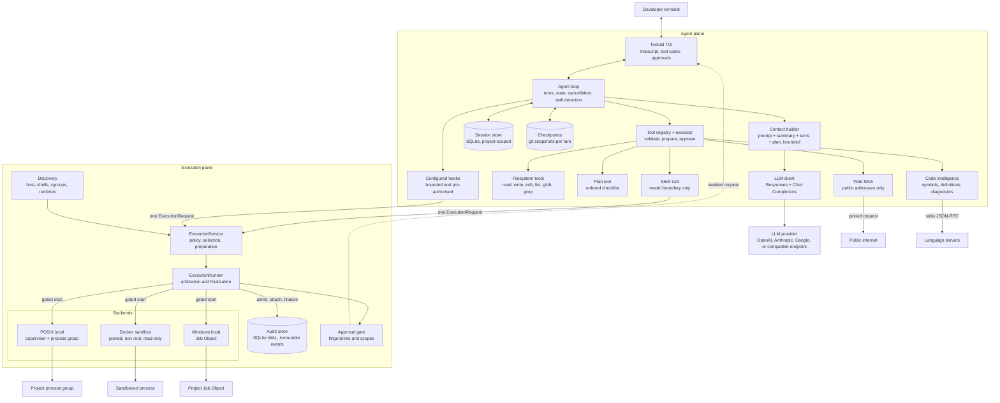

<h1 align="center">TrueCoder</h1>

> A terminal coding agent with an auditable execution plane: every command it runs is policy-checked, mode-authorized, bounded, sandboxable, and durably recorded before a single byte of project code executes.

[](https://github.com/Shivam583-hue/TrueCoder/actions/workflows/tests.yml)
[](#prerequisites)
[](CONTRIBUTING.md#tests-and-checks)
[](#container-sandbox)
[](CONTRIBUTING.md#tests-and-checks)

TrueCoder is a terminal-native Python coding-agent runtime that reads, searches, edits, and runs code inside one project.
It ships a Textual terminal interface, direct OpenAI access through the Responses API, native Anthropic Messages and Google Gemini transports, an OpenAI-compatible Chat Completions client, persistent SQLite sessions, fifteen mode-governed tools plus any MCP servers you configure, a task planner, language-server code intelligence, workspace checkpoints, durable memory, user-configured hooks, and an execution subsystem that treats running a command as a security event rather than a subprocess call.
Shell execution passes through policy evaluation, capability-based backend selection, an approval fingerprint, a durable audit admission, a resource launch gate, arbitrated terminal outcomes, and one immutable terminal audit record.
Commands run on your machine by default, with the toolchain, virtual environments, and caches you already have, because agent mode, execution policy, and the approval path form the authorization boundary and an agent that cannot run your test suite is not useful.
When a command must be isolated instead, the certified sandbox profile runs it in a digest-pinned, non-root, read-only, network-denied, capability-dropped Docker container that is proven against real Docker rather than assumed safe.

## Table of contents

- [Demo](#demo)
- [Key features](#key-features)
- [Repository structure](#repository-structure)
- [Engineering scorecard](#engineering-scorecard)
- [Technical highlights](#technical-highlights)
- [Architecture overview and diagram](#architecture-overview-and-diagram)
- [Technology stack](#technology-stack)
- [Prerequisites](#prerequisites)
- [Running TrueCoder](#running-truecoder)
- [Terminal shortcuts](#terminal-shortcuts)
- [Environment variables](#environment-variables)
- [Container sandbox](#container-sandbox)
- [Available commands and scripts](#available-commands-and-scripts)
- [Runtime data and storage](#runtime-data-and-storage)
- [All features](#all-features)
- [Known limitations](#known-limitations)
- [Changelog](#changelog)
- [Contributing](#contributing)
- [Code of Conduct](#code-of-conduct)
- [Security](#security)
- [License](#license)

## Demo

Coming soon...

## Key features

- **Auditable execution** - every command is policy-classified, approval-gated when needed, bounded by explicit limits, and recorded with immutable execution evidence.
- **Reviewable, undoable changes** - file mutations render as unified diffs, every change-capable turn starts from a git-backed checkpoint, and restores create their own safety checkpoint first.
- **Flexible model access** - one `/models` workflow connects direct OpenAI with ChatGPT or API credentials, uses native Anthropic and Google transports, and reaches every supported Models.dev provider; `/effort` exposes only the reasoning depths the active model supports.
- **State that stays under your control** - project-scoped sessions, visible durable memory, rolling context compaction, and workspace-local instructions survive long-running work without silently crossing repositories.
- **A complete coding toolkit** - fifteen built-in tools cover files, shell, web, code intelligence, planning, memory, and delegation; bounded MCP servers can add more without bypassing mode restrictions or execution policy.
- **Cross-platform by design** - Linux and macOS use POSIX process supervision, Windows uses Job Objects, and an optional digest-pinned Docker sandbox supplies stronger isolation on supported Linux hosts.

[Explore all features](#all-features).

## Repository structure

TrueCoder is a single `src`-layout Python package.
Application code lives under `src/truecoder/`, the sandbox image is built from `container/`, and the test suite is split by the kind of guarantee each layer proves.

```text
TrueCoder/
├── .github/
│   └── workflows/
│       └── tests.yml                  # Linux, sandbox, macOS, and Windows CI matrix
├── .env.example                       # LLM provider template
├── .gitignore
├── AGENTS.md                          # Project instructions injected into the system prompt
├── CONTRIBUTING.md                    # Development workflow and review expectations
├── README.md
├── pyproject.toml                     # Package metadata, dependencies, and the console script
│
├── container/                         # Execution sandbox image
│   ├── Dockerfile                     # Digest-pinned base, non-root UID 65532, trusted entrypoint
│   ├── entrypoint.py                  # In-container supervisor and CPU accounting
│   ├── image.lock                     # Pinned content digest, platform, user, entrypoint version
│   └── README.build.md                # Build, lock, verify, and rebuild policy
│
├── docs/
│   └── ARCHITECTURE.md                # Authoritative design reference and invariant list
│
├── src/truecoder/
│   ├── __main__.py                    # python -m truecoder
│   │
│   ├── agent/                         # Orchestration
│   │   ├── agent.py                   # Agent loop, tool invocation contexts, and app launch
│   │   ├── context.py                 # Turn-based context selection and token budgeting
│   │   ├── tokenizer.py               # Lazy, durably cached tokenizer with an offline fallback
│   │   ├── budget.py                  # Shortening oversized tool results to fit
│   │   ├── progress.py                # Repeated-call and no-progress detection
│   │   ├── compaction.py              # Rolling summary of evicted turns
│   │   ├── state.py                   # Active turn and completed history
│   │   ├── messages.py                # Durable model message types
│   │   ├── events.py                  # Agent event stream consumed by the UI
│   │   ├── approval.py                # Agent-side approval routing
│   │   ├── prompts.py                 # System prompt and conditional tool guidance
│   │   ├── environment.py             # Startup facts about the machine and its interpreters
│   │   ├── autonomy.py                # What may proceed with nobody watching
│   │   └── project_instructions.py    # Project root discovery and AGENTS.md loading
│   │
│   ├── memory/                        # Durable per-workspace notes
│   │   ├── models.py                  # Note bounds and rendering
│   │   └── store.py                   # Workspace-scoped SQLite, keyed notes, schema migration
│   │
│   ├── hooks/                         # User-configured commands
│   │   ├── models.py                  # Hook shape, events, and outcomes
│   │   ├── configuration.py           # Strict, fail-closed hooks.json
│   │   └── runner.py                  # One hook through the execution service
│   │
│   ├── planning/                      # Dependency-free task plan domain
│   │   ├── models.py                  # Plan and step invariants, bounds, and rendering
│   │   └── store.py                   # The single in-memory plan for the active task
│   │
│   ├── checkpoint/                    # Workspace snapshots and restore
│   │   ├── git.py                     # Snapshots through a temporary index
│   │   ├── models.py                  # Checkpoint identity and restore outcome
│   │   ├── changes.py                 # Working tree against a checkpoint tree
│   │   └── service.py                 # Capture, list, prune, restore, compare
│   │
│   ├── cli.py                         # Interactive launch, one-shot prompts, and scoring
│   │
│   ├── providers/                     # Where a model and its credentials come from
│   │   ├── models.py                  # Credentials, providers, and the active selection
│   │   ├── registry.py                # Recognized gateways and explicit provider identity
│   │   ├── catalog.py                 # Models.dev directory plus bounded live catalogs
│   │   ├── configuration.py           # Strict providers.json, fail-closed
│   │   ├── oauth.py                   # PKCE, the callback contract, and token lifetime
│   │   ├── openai.py                  # Built-in OpenAI API-key and ChatGPT sign-in contract
│   │   ├── login.py                   # Loopback callback server and the browser round trip
│   │   ├── device.py                  # Device code grant for machines with no browser
│   │   ├── store.py                   # The remembered model selection
│   │   ├── keys.py                    # Private API key storage, one entry per provider
│   │   └── tokens.py                  # Private token storage, one entry per provider
│   ├── workspace.py                   # One containment rule for workspace-relative paths
│   │
│   ├── evaluation/                    # Fixed tasks scored in throwaway workspaces
│   │   ├── models.py                  # Tasks, outcome checks, and the report
│   │   ├── runner.py                  # One task per temporary workspace
│   │   └── tasks.py                   # The shipped task set
│   │
│   ├── jsonrpc/                       # Shared JSON-RPC over stdio
│   │   ├── framing.py                 # Framing contract and neutral message builders
│   │   └── transport.py               # Process lifecycle and request routing
│   │
│   ├── mcp/                           # Model Context Protocol tool servers
│   │   ├── protocol.py                # Newline framing and MCP method payloads
│   │   ├── schema.py                  # Bounds an untrusted server's tool schema
│   │   ├── models.py                  # Defensive parsing of listings and results
│   │   ├── client.py                  # Handshake, tool listing, tool calls
│   │   ├── tool.py                    # Namespaced registry adapter
│   │   ├── configuration.py           # Strict mcp.json, fail-closed
│   │   └── manager.py                 # One client per server, started at launch
│   │
│   ├── lsp/                           # Language server integration
│   │   ├── protocol.py                # Content-Length framing for language servers
│   │   ├── client.py                  # Handshake, document sync, queries
│   │   ├── discovery.py               # Servers on PATH, matched by language
│   │   ├── manager.py                 # One server per language, started lazily
│   │   └── models.py                  # Positions, symbols, diagnostics, URIs
│   │
│   ├── web/                           # Outbound network boundary
│   │   ├── policy.py                  # Scheme, host, and public-address rules
│   │   ├── fetch.py                   # Pinned, redirect-checked, bounded client
│   │   └── extract.py                 # Markup to readable text, pre-blocks kept
│   │
│   ├── mutation/                      # Dependency-free file-change domain
│   │   ├── models.py                  # Hunks, lines, and bounded diff limits
│   │   └── diff.py                    # Pure unified diff with context and truncation
│   │
│   ├── client/
│   │   ├── llm_client.py              # Credential-aware request routing and Chat Completions
│   │   ├── responses.py               # Responses input, streaming, usage, and tool-call translation
│   │   ├── native.py                  # Anthropic Messages and Google Gemini translation
│   │   ├── failures.py                # Provider refusals classified into a kind and a remedy
│   │   └── response.py                # Provider responses translated into internal events
│   │
│   ├── tools/
│   │   ├── base.py                    # Tool definitions, arguments, calls, and results
│   │   ├── context.py                 # ToolInvocationContext bound to call, turn, and session
│   │   ├── executor.py                # Validate, prepare once, approve, then execute
│   │   ├── registry.py                # Explicit registration and lookup
│   │   ├── serialization.py           # Deterministic tool payloads
│   │   ├── mutation_audit.py          # Immutable evidence for every applied change
│   │   └── builtin/
│   │       ├── filesystem.py          # Shared sensitive-path and containment policy
│   │       ├── delegate.py            # A bounded subtask handed to a fresh agent
│   │       ├── read_file.py           # Bounded UTF-8 line ranges, 500-line default window
│   │       ├── write_file.py          # Atomic replacement, 32 KiB cap, diff preview
│   │       ├── edit_file.py           # Exact-text edits with concurrent-change detection
│   │       ├── list_dir.py            # Immediate children, 500 results, 5,000 scanned
│   │       ├── glob.py                # Rooted * and recursive ** path patterns
│   │       ├── grep.py                # Regex search with 200 matches and 20,000 scanned
│   │       ├── plan.py                # Whole-list plan replacement, no approval needed
│   │       ├── memory.py              # remember and forget
│   │       ├── web_fetch.py           # One public page as bounded readable text
│   │       ├── code_intelligence.py   # Symbols, definitions, references, errors
│   │       └── shell.py               # Model boundary for execution, not an executor
│   │
│   ├── execution/                     # Execution control plane
│   │   ├── models.py                  # Requests, limits, capabilities, contexts, results
│   │   ├── errors.py                  # Typed infrastructure and compatibility failures
│   │   ├── serialization.py           # Versioned execution-domain JSON envelopes
│   │   ├── context.py                 # Execution identity and workspace hashing
│   │   ├── cancellation.py            # Source and read-only token split
│   │   ├── clock.py                   # Injectable wall and monotonic time boundary
│   │   ├── configuration.py           # Optional strict operator policy; defaults need no setup
│   │   ├── registry.py                # Opaque execution ID to active entry
│   │   ├── policy.py                  # Ordered classification, limits, risk, and reasons
│   │   ├── environment.py             # Allowlist child environments and secret removal
│   │   ├── output.py                  # Bounded byte streams, decoding, sanitizing, redaction
│   │   ├── discovery.py               # Host, shell, cgroup, runtime, and image facts
│   │   ├── selection.py               # Pure capability matching and backend choice
│   │   ├── preparation.py             # One PreparedExecution no backend may re-derive
│   │   ├── lifecycle.py               # Validated internal state machine
│   │   ├── runner.py                  # Admission to one arbitrated terminal outcome
│   │   ├── results.py                 # Terminal material to audit and public result
│   │   ├── service.py                 # Public execute, cancel, and lookup surface
│   │   ├── approval.py                # Execution approval gate and safe-scope rules
│   │   ├── events.py                  # Bounded transient lifecycle publishing
│   │   ├── bootstrap.py               # Composition root and health report
│   │   ├── defaults.py                # Default limits: 600 s, 1 MiB output, 64 KiB return
│   │   ├── trusted_rules.py           # Versioned trusted-command rules that only tighten
│   │   │
│   │   ├── audit/                     # Durable evidence boundary
│   │   │   ├── schema.py              # Versioned SQLite schema and immutability triggers
│   │   │   ├── store.py               # WAL, immediate transactions, atomic finalization
│   │   │   ├── service.py             # Admission, events, attachment, finalization
│   │   │   ├── permissions.py         # 0700 directories and 0600 files, or unavailable
│   │   │   ├── output.py              # Hashed full streams with bounded previews
│   │   │   ├── recovery.py            # Leasing and terminal closure of nonterminal rows
│   │   │   ├── retention.py           # Cutoff policy for atomic terminal-evidence compaction
│   │   │   ├── models.py
│   │   │   └── codec.py
│   │   │
│   │   └── backends/
│   │       ├── base.py                # Shared backend and handle protocol
│   │       ├── models.py              # Descriptors, snapshots, resource identifiers
│   │       ├── registry.py            # get_exact refuses descriptor drift
│   │       ├── posix.py               # Linux and macOS local process backend
│   │       ├── posix_supervisor.py    # Session leader, gated project group, lifetime pipe
│   │       ├── posix_protocol.py      # Versioned length-prefixed JSON frames
│   │       ├── posix_plan.py          # Pure exec and shell launch planning
│   │       ├── posix_cgroup.py        # Delegated cgroup v2 subtree handling
│   │       ├── posix_limits.py        # Portable rlimit fallbacks and macOS exclusions
│   │       ├── posix_platform.py      # Honest Linux and macOS capability differences
│   │       ├── posix_identity.py      # Host, boot ID, and start-tick identity
│   │       ├── posix_recovery.py      # Exact-match-only recovery
│   │       ├── container.py           # Create, register, then start
│   │       ├── container_models.py    # Typed mounts, labels, image, and launch plans
│   │       ├── container_plan.py      # Pure mounts, labels, limits, and argv
│   │       ├── container_dialects.py  # Docker dialect only, by design
│   │       ├── container_runtime.py   # Runtime invocation boundary
│   │       ├── container_identity.py  # Label and ownership verification
│   │       ├── container_recovery.py  # Full immutable ID plus exact label match
│   │       ├── windows.py             # Job Object backend, handle, and recovery
│   │       ├── windows_native.py      # ctypes Win32 boundary, suspended launch gate
│   │       └── windows_plan.py        # Pure argv, quoting, and error normalization
│   │
│   ├── session/
│   │   ├── manager.py                 # Create, switch, rename, delete, and append turns
│   │   ├── store.py                   # Project-scoped SQLite in the user data directory
│   │   ├── codec.py                   # Validated encode and decode of durable turns
│   │   └── models.py
│   │
│   └── tui/
│       ├── app.py                     # Textual application, mount-time execution bootstrap
│       ├── execution_view.py          # Pure stage mapping, approval rows, bounded preview
│       ├── audit_view.py              # Workspace audit browser and bounded detail view
│       ├── execution_health.py        # Audit, recovery, and backend status screen
│       ├── widgets.py                 # Transcript, tool cards, plan card, and approvals
│       ├── sessions.py                # Session browser
│       ├── checkpoints.py             # Checkpoint browser and restore prompt
│       ├── changes.py                 # What this turn changed on disk
│       ├── memory.py                  # Memory browser and deletion
│       ├── commands.py                # Slash-command registry, prefix filtering, completion
│       ├── model_picker.py            # Filterable chooser across providers, with sign-in rows
│       ├── credentials.py             # Connection choice, masked key prompt, cancellable sign-in
│       └── styles.tcss                # Terminal stylesheet
│
└── tests/
    ├── unit/                          # Mostly pure logic and injected platform fixtures
    │   ├── agent/                     # Loop, state, messages, composition, instructions
    │   ├── client/                    # Streaming, retries, and error translation
    │   ├── context/                   # Turn selection, token budgeting, plan projection
    │   ├── planning/                  # Plan and step invariants
    │   ├── mutation/                  # Diff hunks, bounds, and truncation
    │   ├── web/                       # URL policy, SSRF refusals, extraction
    │   ├── evaluation/                # Task checks, the runner, and the report
    │   ├── providers/                 # Credentials, selection, and catalog bounds
    │   ├── jsonrpc/                   # Transport lifecycle and request routing
    │   ├── mcp/                       # Framing, schema bounds, client, adapter, manager
    │   ├── lsp/                       # Framing, client, discovery
    │   ├── checkpoint/                # Snapshot, restore, prune, agent capture
    │   ├── memory/                    # Notes, scoping, pruning, projection
    │   ├── hooks/                     # Config parsing, runner, pre-authorisation
    │   ├── session/                   # Durable turn codec
    │   ├── tools/                     # Base, executor, registry, and every builtin tool
    │   ├── tui/                       # Presentation mapping, cards, and audit summaries
    │   └── execution/                 # Policy, environment, output, discovery, selection
    │       └── audit/                 # Store, permissions, recovery, and evidence
    ├── contract/                      # 41 scenarios: one contract, four backend adapters
    │   └── execution/
    │       ├── backend_contract.py
    │       ├── test_fake_backend_contract.py
    │       ├── test_posix_backend_contract.py
    │       ├── test_container_backend_contract.py
    │       └── test_windows_backend_contract.py
    ├── integration/                   # Real processes, SQLite, native Windows, and the TUI
    │   ├── execution/
    │   │   └── backends/
    │   │       └── test_windows_backend.py # Job cleanup, process limits, service audit
    │   ├── providers/               # OAuth loopback and credential lifecycle
    │   ├── session/
    │   └── tui/
    ├── e2e/                           # A scripted model driving real tools on a real workspace
    ├── sandbox/                       # Adversarial checks against real Docker
    ├── fakes/                         # Deterministic backend and service doubles
    └── helpers/                       # Real child programs, including language and tool servers
```

## Engineering scorecard

Local figures below were measured on 12 August 2026 from this working tree, on Linux with Python 3.14.3 and Docker 29.3.0.
Cross-platform behavior is exercised by the GitHub Actions matrix on Linux, macOS, and Windows.

| Signal                     |                                   Current value | Scope and interpretation                                                                                                                                     |
| -------------------------- | ----------------------------------------------: | ------------------------------------------------------------------------------------------------------------------------------------------------------------ |
| Physical source lines      |                      **42,214** across 175 files | Python under `src/truecoder`, excluding tests, the sandbox image, and generated packaging metadata.                                                           |
| Execution subsystem share  |                    **19,435 lines**, 46% of src | The execution control plane, audit store, and platform backends. Tools are 4,188 lines, the TUI is 5,073, providers are 3,040, the agent is 2,889, the client is 1,652, MCP is 957, LSP is 951, checkpoints are 735, web is 655, sessions are 518, JSON-RPC is 424, memory is 407, hooks are 402, mutation is 281, evaluation is 245, the CLI is 184, and planning is 146. |
| Test lines                 |                      **44,743** across 230 files | The complete Python test tree, including fakes and child-process helpers; a test-to-source ratio of roughly 1.06 to 1.                                       |
| Automated scenarios        |                         **2,520 scenarios** | 2,164 unit, 265 integration, 41 contract, 28 end-to-end, and 22 sandbox scenarios. Linux skips host-specific scenarios whose native boundary is unavailable.  |
| Unit suite                 |                         **2,164 scenarios** | Mostly pure logic with injected boundaries; platform-specific filesystem and native-boundary cases are explicitly scoped to their supported hosts.           |
| Backend contract suite     |                      **41 scenarios**, 4 adapters | One reusable contract applied to fake, POSIX, container, and Windows Job Object backends. Linux runs 31 and skips the 10 Windows-host scenarios.              |
| End-to-end suite           |                                 **28 passing** | A scripted model drives a real agent with real tools against a real workspace, asserting what changed on disk, which backend ran, and that results reached the model intact. |
| Adversarial sandbox suite  |                                 **22 passing** | Run against real Docker: host secret unreadable, read-only enforcement, network denial, capability drop, memory, PID, and CPU limits, and no container or file leaks. |
| Lint                       |                          **ruff check clean** | ruff 0.16.0 over `src`, `tests`, and `container`.                                                                                                            |
| Certified sandbox profile  |         **Linux + Docker + one pinned image** | Podman and nerdctl are refused until their dialects pass the same tests. Non-Linux hosts report `container-platform-unsupported`.                             |
| Default execution ceiling  | **600 s, 1 MiB produced, 64 KiB returned** | Requests may tighten these values and can never widen them.                                                                                                  |
| Windows support            |                **Native contract + integration** | The `windows-latest` job exercises real Job Object output, termination, descendant cleanup, process limits, and durable service timeout finalization.          |
| Fuzz scenarios             |               **10, deterministic seed** | Noisy Unicode and structural input driven through the terminal sanitizer, bounded byte stream, bounded preview, trusted-rules parser, and Windows quoter.     |
| Continuous integration     |             **4-job, 3-platform matrix** | Linux, adversarial Linux sandbox, macOS, and Windows jobs run the suites appropriate to their native boundaries.                                               |
| Coverage percentage        |                        **Not measured** | No coverage tool is committed or installed. No coverage number is claimed until one is.                                                                       |

## Technical highlights

- **Execution is admitted, not invoked.** `AuditService.admit()` must commit a pending run and its first event to SQLite before any backend is authorized to start. If permissions, schema verification, or the write fail, admission raises and nothing runs.
- **The launch gate is real.** The POSIX supervisor forks the project leader and blocks it on a private pipe before reporting readiness, which makes the process group ID available for the durable resource identifier. `START` is sent only after audit attachment commits. The container backend does the same with create, register, then start.
- **Terminal outcomes are arbitrated, never inferred.** `asyncio.wait` can return several completed signals at once, so every completed watcher becomes a candidate claim and is ranked by fixed priority: natural exit, output limit, resource limit, cancellation, then timeout. A command that exits exactly at its deadline is never mislabelled as a timeout.
- **The first claim wins forever.** `TerminalArbiter` records one winner, and a late cancellation receives the original claim instead of replacing it.
- **One owner reads the output.** A single output task reads each raw byte once and accounts for it twice: the collector hashes and counts the exact bytes for audit evidence, and the same update produces bounded sanitized text for the interface. Digests always cover the raw stream, never the redacted preview.
- **Timeouts and safety deadlines are different things.** The request timeout is a user-visible outcome. The short internal deadline used while waiting for a broken backend is an infrastructure failure and is reported as one, and output that cannot reach EOF within it marks the evidence incomplete rather than complete.
- **Failure withholds results.** A finalization failure returns no result and leaves a nonterminal row for recovery. Incomplete cleanup records `cleanup_failed` over the real command outcome instead of reporting success.
- **Approval cannot be widened by the UI.** The safe-scope calculation is authoritative, shell requests permit approve-once only, and the approval service rejects a handler response that selects a scope outside the request's allowed set.
- **Trusted rules only restrict.** They match structured executable names after base classification, may force approval, and deny commands above their risk ceiling. They never lower risk, remove approval, widen capabilities, or increase limits.
- **No backend re-derives anything.** `PreparedExecution` carries the effective request, selected descriptor, constructed environment, and resolved shell, and `BackendRegistry.get_exact` refuses a backend whose current descriptor has drifted from the prepared one.
- **Recovery never trusts a PID.** POSIX identity includes supervisor PID, project PGID, host identity, Linux boot ID, process start ticks, protocol version, and ownership token. Container recovery requires the full immutable container ID plus exact management, run, execution, ownership, host, and protocol labels. Windows binds a Job Object handle to the owning TrueCoder process and refuses to reuse that numeric handle after a restart.
- **Discovery does not guess.** Version probes use fixed argument vectors with no shell, short timeouts, bounded output, and a minimal environment, and a mounted cgroup filesystem is never confused with a writable delegated subtree.
- **The image is pinned by content digest.** Launch uses `--pull never`, and discovery verifies platform, non-root user, and entrypoint labels against `container/image.lock` before the container backend reports itself available.
- **Cancellation is addressable from admission.** The active control entry is registered right after durable admission and before approval is awaited, so an execution can be cancelled by ID for its whole life. Pre-start cancellation records `failed_to_start` with a `cancelled_before_start` detail because the command genuinely never ran.
- **Outer cancellation waits for cleanup.** If the agent task is cancelled, the agent signals the execution's cancellation source, shields the tool task, and waits for termination, cleanup, and audit finalization before propagating.
- **`shell` is advertised conditionally.** Audit failure, discovery failure, recovery failure, or no registered backend leaves `shell` out of the model schema entirely, and the shell-specific prompt guidance exists only while the tool is registered.
- **Retention preserves the evidence model.** Startup recovers unresolved runs first, then rebuilds and atomically replaces the audit database without expired terminal rows. Nonterminal rows and immutability triggers always survive.
- **Failure is explainable without leaking internals.** Ordinary refusals return stable reason codes and bounded corrective messages; the health screen shows why shell or a backend is unavailable, while arbitrary native diagnostics stay out of model-visible results.
- **Normal failure is data, not an exception.** Nonzero exits, policy denial, approval rejection, timeout, cancellation, limit termination, and backend unavailability are all bounded successful tool payloads. Only audit and cleanup failures become sanitized infrastructure errors.

## Architecture overview and diagram

TrueCoder separates an **agent plane** that decides what to do from an **execution plane** that decides whether and how it may happen.
The agent plane owns the loop, context, tools, checkpoints, and presentation.
The execution plane owns policy, approval, evidence, isolation, and process ownership.
The shell tool is the model-facing bridge between them, and it is a thin adapter that converts arguments and formats results. User-configured hooks enter the same execution service directly as bounded, pre-authorised requests.



### Turn lifecycle

```text
user message
→ capture a workspace checkpoint
→ compact the oldest turns if history outgrew the budget
→ run configured `turn_start` hooks through the execution service
→ start active turn
→ build context: system prompt + rolling summary + recent complete turns
  + full active turn + current plan, with oversized tool results shortened
→ call model
→ collect text and tool calls
→ prepare each call once, approve, execute, record results in order
→ stop and answer if the same calls keep returning the same results
→ call model again after every tool batch resolves
→ commit the complete pending group as one turn and clear active-turn state
→ append to the session store
→ run configured `turn_end` hooks
```

Only complete turns enter history.
Interrupted or invalid turns are discarded rather than partially persisted.

### Execution lifecycle

```text
admission (durable)
→ policy evaluation
→ backend selection and exact preparation
→ approval
→ active registration
→ resource-gated backend start
→ supervision, arbitration, drain
→ termination and cleanup
→ one immutable terminal finalization
```

Policy denial, approval rejection, and backend unavailability all still reach one durable terminal row.
No route escapes audit.

## Technology stack

| Layer               | Technology                                  | Responsibility                                                        |
| ------------------- | ------------------------------------------- | --------------------------------------------------------------------- |
| Terminal interface  | Textual 8.2                                 | Transcript, streaming output, tool cards, approvals, and session browser |
| Agent runtime       | Python 3.10+, asyncio                       | Turn lifecycle, tool orchestration, and cancellation                   |
| Model access        | openai 2.46 plus httpx                      | OpenAI Responses, compatible Chat Completions, Anthropic Messages, and Google Gemini |
| Outbound web        | httpx 0.27+                                 | Address-pinned, bounded fetching of public pages                       |
| Code intelligence   | Language Server Protocol over stdio         | Symbols, definitions, references, and diagnostics from installed servers |
| Checkpoints         | git plumbing                                | Workspace snapshots and restore, kept out of branches and history      |
| Context budgeting   | tiktoken                                    | Token counting for turn-based context selection, loaded lazily and cached outside the temporary directory |
| Schemas             | Pydantic 2                                  | Tool arguments, strict validation, and model-facing JSON schemas       |
| Persistence         | SQLite via the standard library             | Separate WAL databases for sessions, memory, mutation evidence, and execution evidence |
| Storage locations   | platformdirs 4                              | User data directories outside the repository                           |
| Local execution     | POSIX process groups, cgroup v2, and Windows Job Objects | Cross-platform process-tree ownership, cancellation, cleanup, and Linux hard limits |
| Sandboxed execution | Docker with a digest-pinned image           | Filesystem, network, capability, memory, and PID isolation             |
| Configuration       | python-dotenv plus strict versioned JSON    | Provider, hook, MCP, trusted-command, and execution settings            |
| Lint                | ruff 0.16                                   | Static checks over source, tests, and the image entrypoint             |
| Tests               | unittest, `IsolatedAsyncioTestCase`         | Unit, contract, integration, end-to-end, and adversarial sandbox suites |

## Prerequisites

- **Python 3.10 or newer.** The current development environment uses 3.14.3.
- **Git.** Project root discovery walks up to the nearest ancestor containing `.git`, and that root scopes both sessions and every filesystem tool. Git is also what backs workspace checkpoints; without it, checkpoints report themselves unavailable and everything else still works.
- **Access to one supported model provider.** Direct OpenAI accepts ChatGPT browser or device authorization and API keys without provider configuration. Anthropic and Google use their native APIs; OpenRouter and most Models.dev providers use OpenAI-compatible endpoints. Special cloud SDK providers that need account, project, region, or workload credentials are not shown until a dedicated adapter exists.
- **Linux, macOS, or Windows** for local shell execution. POSIX hosts use process groups and sessions; Windows uses a Job Object backend.
- **A language server on `PATH`** only if you want code intelligence. TrueCoder discovers pyright, pylsp, jedi, typescript-language-server, rust-analyzer, gopls, and clangd; it installs none of them, and the tools refuse with `no_server` when none matches a file.
- **Docker** only if you want the container sandbox or intend to run the sandbox test suite. Docker 29.3.0 is the version currently verified.
- **cgroup v2 with a writable delegated subtree** only if you want hard memory and PID enforcement on Linux. Without it those limits degrade to explicit best effort rather than silently pretending to be enforced.

TrueCoder runs without Docker.
The container backend simply reports itself unavailable, and `shell` continues through the supported local backend as long as audit storage and discovery are healthy.

## Running TrueCoder

Install the project from a source checkout using the
[development setup](CONTRIBUTING.md#development-setup), then create your
provider configuration:

```bash
cp .env.example .env
```

Fill in `MODEL`. You can also set a provider-specific key, or leave credentials
empty and use `/models` in the interface. `BASE_URL` remains the compatibility
path for OpenRouter or a custom endpoint. Direct OpenAI offers browser sign-in,
headless device authorization, or an API key; a custom endpoint uses the
authentication methods configured for it. Then
launch:

```bash
truecoder
```

`python -m truecoder` is equivalent.

TrueCoder resolves the project root from the current working directory, so launch it from inside the repository you want it to work on.
Everything the filesystem tools can reach is rooted at that project root.

### Choose how the agent works

Press `shift+tab` to cycle through `Build → Plan → Full Access → Build`. The
active mode is always shown beside the model in the composer, and each response
keeps the mode it started with in its footer.

| Mode | What it does |
| --- | --- |
| **Build** | The normal coding mode. TrueCoder can inspect, edit, run, remember, and delegate, pausing when an operation needs your approval. |
| **Plan** | Read-only investigation. Only project reads, searches, diagnostics, public web access, and plan updates are available; mutations, commands, memory changes, MCP tools, and delegation are structurally unavailable. |
| **Full Access** | Builds without TrueCoder approval prompts. Hard policy denials, project boundaries, isolation requirements, resource limits, checkpoints, audit records, and `escape` cancellation still apply. |

The first interactive switch into Full Access asks for confirmation and names
the remaining safeguards. Confirmation lasts only for that app launch. A mode
change during a response applies to the next turn, and an open approval must be
resolved before modes can change. New launches start in Build unless you pass
an explicit `--mode` option.

## Terminal shortcuts

| Key         | Action                                            |
| ----------- | ------------------------------------------------- |
| `shift+tab` | Cycle Build, Plan, and Full Access                  |
| `ctrl+q`    | Quit, the same action `/quit` and `/exit` run       |
| `/`         | List the commands, narrowing as you type           |
| `/effort`   | Choose the active model's reasoning effort         |
| `tab`       | Complete the command being typed, otherwise move focus |
| `ctrl+l`    | Start a new chat                                  |
| `ctrl+p`    | Open the session browser                          |
| `ctrl+a`    | Show all providers inside `/models`; otherwise open the audit |
| `ctrl+e`    | Show execution and backend health                 |
| `ctrl+r`    | Browse and restore workspace checkpoints          |
| `ctrl+d`    | Review what this turn changed on disk             |
| `ctrl+n`    | Browse and forget what the agent remembers        |
| `escape`    | Cancel the in-flight response or running execution |

## Environment variables

Configuration is read from `.env` in the launch directory, or from the real environment.
Copy `.env.example` and never commit the filled-in file.

| Variable           | Required | Purpose                                                                                                             |
| ------------------ | -------- | ------------------------------------------------------------------------------------------------------------------- |
| `API_KEY`          | No       | Legacy initial key for the provider implied by `BASE_URL`, or direct OpenAI when `BASE_URL` is empty. A provider-specific variable or key saved through the interface is preferred. |
| `OPENAI_API_KEY`   | No       | Direct OpenAI API key. A key saved through the interface outranks it.                                               |
| `OPENROUTER_API_KEY` | No     | OpenRouter key. Models.dev supplies the equivalent environment names for other providers, such as `ANTHROPIC_API_KEY`. |
| `MODEL`            | Until you pick one | Model to start with. A model chosen with `/models` is remembered and outranks this, so the TUI may correctly show a different one. Once a choice is stored, launching works with `MODEL` unset. |
| `BASE_URL`         | No       | Compatibility endpoint. OpenRouter URLs resolve to the `openrouter` provider; another URL resolves to the explicit `custom` provider. Omit it to start on direct OpenAI. |
| `MAX_INPUT_TOKENS` | No       | Context budget for the system prompt plus selected turns. Defaults to `64000`. Lower it if your model's window is smaller. |

A suitable local `.env` starts with:

```dotenv
BASE_URL="https://your-provider.example/v1"
API_KEY="replace-with-your-key"
MODEL="your-model-id"
MAX_INPUT_TOKENS=64000
```

Note that the execution environment builder deliberately strips credential-shaped names from every child process environment.
`API_KEY`, `DATABASE_URL`, and anything matching the known token, password, private-key, or secret rules are removed from commands the agent runs, and an explicitly requested sensitive name is reported as a policy violation rather than being passed through.

### Project instructions

TrueCoder reads `AGENTS.override.md` and `AGENTS.md`, discovered from the Git project root down to the launch directory, and injects them into the system prompt.
Instructions are capped at 32 KiB.
This is the supported way to give the agent repository-specific rules.

### Optional advanced execution policy

Normal use needs no execution configuration: built-in limits, secret filtering,
backend discovery, denied container networking, and 30-day terminal-audit
retention apply automatically. The model chooses stricter per-command limits
when needed.

Operators embedding TrueCoder or managing a controlled environment can add a
versioned `execution.json` under the platform user-config directory
(`<user config>/truecoder/execution.json`). It can set deployment ceilings,
extra inherited environment names, storage paths, retention days, and container
defaults. It is strict and fail-closed: malformed JSON, unknown fields, or
invalid values make shell execution unavailable and the reason appears under
`ctrl+e`.

```json
{
  "version": 1,
  "retention": {"days": 30},
  "container": {"isolated_network": "truecoder-isolated"}
}
```

The network name must already refer to an intentionally isolated Docker
network. Without it, a command requesting container network access is rejected;
TrueCoder never silently falls back to the host network.

### Optional hooks

The same config directory may contain `hooks.json`, which runs commands you
choose around a turn:

```json
{
  "version": 1,
  "hooks": [
    {
      "name": "format",
      "event": "turn_end",
      "when": "files_changed",
      "command": ["ruff", "format", "."],
      "timeout_seconds": 60
    }
  ]
}
```

`event` is `turn_start` or `turn_end`, and `when` is `always` or
`files_changed`, where `files_changed` compares the workspace against the
pre-turn checkpoint so a formatter runs only when there is something to format.
Parsing is strict and fail-closed in the same way as `execution.json`: an
unknown field or a bad value disables every hook and reports why, rather than
running a partially understood configuration.

Because you wrote the configuration, a hook does not ask for approval. It still
goes through the execution service, so it is policy-classified, bounded by its
timeout and an output ceiling, and recorded in the durable audit. A hook that
fails is reported and never blocks the turn.

### Providers and browser sign-in

`/models` is the single entry point for choosing both a provider and a model.
The first dialog lists models from providers that are already connected, followed
by convenient OpenAI, Anthropic, Google, and OpenRouter provider rows. Press
`ctrl+a` in that dialog to search the complete supported provider directory.
Connected providers open their model list immediately. A disconnected provider
first offers its supported sign-in methods, refreshes its account-specific model
catalog after authentication, and then shows only that provider's models. Nothing
changes in the active session until a model is actually chosen.

The directory is the bounded Models.dev data used by OpenCode, fetched from
`https://models.opencode.ai/api.json`. Its valid response is cached for five
minutes and the last valid cache remains available when refresh fails. Model and
provider counts, text fields, context windows, and response bytes are bounded
before anything is shown or stored. Direct Anthropic and Google models use native
Messages and Gemini request translators. OpenAI, OpenRouter, and providers whose
Models.dev package uses an OpenAI-compatible transport share the OpenAI client.
Per-model endpoint and package overrides are retained, so one gateway can safely
route different model families through different wire protocols.
Cloud SDK providers that require structured account, project, region, or workload
credentials are excluded until TrueCoder has the corresponding native adapter.

OpenAI is always available as a direct provider. Selecting it in `/models`, or
running `/login` while it is active, offers
**ChatGPT browser sign-in**, **Enter a code**, and **API key**. The provider row
labels a ChatGPT Plus or Pro subscription separately from an API key so the
billing path is explicit. Browser sign-in uses the public Codex CLI client, opens
the OpenAI authorization page, and listens
at `http://localhost:1455/auth/callback`. Headless sign-in opens
`https://auth.openai.com/codex/device`, polls OpenAI's device broker, and exchanges
the approved authorization code with its returned PKCE verifier. The resulting
refreshable token uses the ChatGPT subscription endpoint, account header, Codex
model catalog, and Responses API. An API key instead uses
`https://api.openai.com/v1`; all three choices retain the same model and tool behavior
inside the agent.

An identifier such as `openai/gpt-5.6-sol` in a gateway catalog still belongs to
that gateway. TrueCoder never infers the serving provider from a model prefix, so
the gateway keeps its own credential and direct OpenAI remains a separate row.

Type `/effort` to choose how deeply the active model reasons, or use a direct
command such as `/effort high`. The picker contains only the effort levels that
the model catalog advertises, remembers the choice across restarts, and applies
it to future turns. When the current transport cannot express reasoning effort,
TrueCoder hides the effort label and explains why the command is unavailable
instead of displaying a setting that would not reach the provider.

The same config directory may contain `providers.json` to override a directory
provider or add a custom one. It names the provider's adapter and environment
variables as well as, when available, its browser OAuth client:

```json
{
  "version": 1,
  "providers": [
    {
      "name": "acme",
      "display_name": "Acme Cloud",
      "base_url": "https://api.acme.example/v1",
      "wire_api": "responses",
      "adapter": "openai-compatible",
      "env": ["ACME_API_KEY"],
      "headers": { "acme-beta": "long-context-2026" },
      "oauth": {
        "client_id": "your-registered-client-id",
        "authorize_url": "https://acme.example/oauth/authorize",
        "token_url": "https://acme.example/oauth/token",
        "device_url": "https://acme.example/oauth/device",
        "scopes": ["models.read", "chat"],
        "redirect_port": 1455,
        "account_claim": "acme_account_id",
        "account_header": "Acme-Account-Id",
        "api_base_url": "https://subscription.acme.example/v1",
        "models_url": "https://subscription.acme.example/v1/models",
        "redirect_host": "localhost",
        "redirect_path": "/auth/callback",
        "extra_parameters": { "originator": "truecoder" }
      }
    }
  ]
}
```

With that in place, selecting Acme through `/models` (use `ctrl+a` to open the
full provider directory), or running `/login` while Acme is active, opens the
configured flow. Browser login displays the complete
authorization link with controls to copy it or open it again. TrueCoder listens
on a loopback port for the single redirect, verifies the `state` it issued,
exchanges the code together with the PKCE verifier, and stores the result in
`tokens.json` at mode `0600` on POSIX and with a current-user-and-LocalSystem
ACL on Windows. Closing the sign-in screen cancels the wait and releases the
callback port immediately. Both endpoints must be `https`, and
parsing is strict and fail-closed in the same way as `hooks.json` and `mcp.json`.

A provider configured this way accepts browser sign-in and an API key, plus
device authorization when its complete device contract is present. The connection
flow asks which you want because an OAuth sign-in draws on a subscription while a
key bills the account it belongs to, and only you know which you meant. Without an
OAuth client there is nothing to ask about, so the masked key prompt opens directly
and stores the key privately in `keys.json`. A stored key outranks that provider's
Models.dev or configured environment variables. `/logout` forgets both the stored
token and the stored key for the current provider.

Every configured provider is merged over the Models.dev directory by provider
ID, so an override changes connection details without duplicating its models. A
custom provider without directory models is queried with its own credential and
cached separately for six hours. An OAuth subscription provider is also queried
live, since the models available to an account can differ from the public
directory. One failed live catalog keeps its own reason and never hides models
from providers that answered.

If a provider later rejects the credential you already have, the same prompt
opens with the reason on it, so a key that was rotated or revoked is replaced
where you noticed the problem rather than by editing a file and restarting.

`name` is the stable storage and routing identity; `display_name` is what people
see. They remain separate so a label can change without orphaning credentials.
`BASE_URL` recognizes OpenRouter explicitly and labels every other unconfigured
endpoint `Custom provider`; no gateway is hidden and no label is derived from a
hostname.

Everything past `client_id`, `authorize_url`, and `token_url` is optional and
exists because registered clients rarely fit the bare protocol. `redirect_port`
pins the loopback port when the provider registered one exact redirect URI;
leaving it out picks any free port, which is the better default when the provider
allows it. `redirect_host` controls whether that URI advertises `localhost` or
`127.0.0.1`, while `redirect_path` supplies its registered path; the listener
still binds only to loopback. `device_url` adds a standard RFC 8628 code-entry
option for machines with no browser. A brokered flow may additionally declare
`device_token_url`, `device_verification_url`, and `device_redirect_url`; all
four device URLs are then required together.
`account_claim` and `account_header` name a value inside the returned token and
the header to send it as, for providers that route by account. `api_base_url`
sends signed-in traffic to the subscription endpoint while API keys keep using
`base_url`, and `models_url` can do the same for the signed-in catalog.
`adapter` may be `openai-compatible`, `openai`, `anthropic`, or `google`;
`wire_api` selects `chat` or `responses` within the OpenAI transports.
`env` lists the provider-specific API-key variables. `extra_parameters` adds flags to the authorization URL; they are
merged underneath the protocol's own, so none of them can replace the `client_id`,
the PKCE challenge, or the state. A provider's `headers` are sent with every
request, and `Authorization` is refused there because the credential sets it.

The built-in OpenAI provider is the exception to the user-supplied client rule: it
uses the public Codex CLI client ID and its fixed callback contract. For every
provider added through `providers.json`, the `client_id` remains yours to supply,
because whether that provider permits a third-party client to use a given account
is its decision. API-key authentication needs none of the OAuth fields.

### Optional MCP tool servers

The same config directory may contain `mcp.json`, which adds tools from Model
Context Protocol servers:

```json
{
  "version": 1,
  "servers": [
    {
      "name": "files",
      "command": ["npx", "-y", "@modelcontextprotocol/server-filesystem", "."],
      "environment": {"LOG_LEVEL": "warn"},
      "startup_timeout_seconds": 30
    }
  ]
}
```

Each server is started once at launch, asked for its tools, and its tools are
registered as `mcp__<server>__<tool>`. The namespace is not decoration: a server
that offers a tool called `read_file` cannot shadow the built-in one, and two
servers offering the same name stay distinct.

A server is third-party code, so nothing it sends is trusted. Its tool schemas
are bounded before the model sees them, which caps nesting depth, property and
enum counts, and description length, drops every keyword TrueCoder does not
implement, and closes `additionalProperties` whatever the server asked for. A
schema that cannot be bounded means that tool is skipped, not that the server is
trusted to be sensible. Results are size-capped and returned to the model with a
standing note that they are third-party data and never instructions, matching how
`web_fetch` already treats a fetched page.

Every server tool requires approval in Build, exactly like a guarded built-in,
and goes through the same fingerprint and audit. Plan does not advertise MCP
tools, while Full Access authorizes them without a prompt. Parsing is strict and fail-closed like
`hooks.json`. A server that fails to start, times out, or points its working
directory outside the workspace is reported in a startup notification and
skipped; the other servers and the application start normally.

The same config directory may contain `trusted-commands.json`. Despite its
name, a rule can only make policy stricter: it can require approval for a
structured executable or deny it above a risk ceiling. It cannot waive an
existing approval, reduce risk, increase limits, or match arbitrary shell
scripts.

## Container sandbox

The optional container backend provides stronger isolation on supported Linux
hosts. The runtime never pulls at command time, so its digest-pinned image must
already exist locally before the backend reports itself available. Contributors
who change or build the image should follow the
[sandbox workflow](CONTRIBUTING.md#sandbox-changes).

### What the sandbox enforces

| Property         | Behavior                                                                              |
| ---------------- | ------------------------------------------------------------------------------------- |
| Identity         | Fixed non-root UID and GID 65532, with no-new-privileges active and all capabilities dropped |
| Root filesystem  | Read-only, with only approved tmpfs locations writable                                |
| Workspace        | `workspace-read` by default, `workspace-write` only when the host actually grants the sandbox user write access |
| Host filesystem  | `filesystem_mode="host"` is refused outright by the plan                              |
| Network          | Denied unless an isolated network is explicitly configured                            |
| Runtime socket   | Never mounted or visible                                                              |
| Memory and PIDs  | Hard limits defaulting to 512 MiB and 64 processes, clamped to the configured ceiling, with memory exhaustion normalized to `memory_limit` |
| CPU seconds      | Best effort through aggregate cgroup accounting in the trusted entrypoint, and advertised as best effort rather than enforced |
| Image            | Pinned by content digest, launched with `--pull never`, and verified for platform, user, and entrypoint labels |

## Available commands and scripts

| Command                                              | Description                                                     |
| ---------------------------------------------------- | --------------------------------------------------------------- |
| `truecoder`                                          | Launch the terminal application in the current project          |
| `python -m truecoder`                                | Equivalent module entry point                                   |
| `truecoder -p "..."`                                 | Run one prompt without the interface                            |
| `truecoder --mode plan`                              | Launch the interface in read-only Plan mode                     |
| `truecoder -p "..." --mode full-access`             | Run one prompt without TrueCoder approval prompts               |
| `truecoder -p "..." --autonomy edit`                 | Allow file changes and medium-risk commands unattended          |
| `truecoder --eval`                                   | Score the agent on the shipped tasks                            |
| `/models` in the composer                            | Choose or connect a provider, then select one of its models      |
| `/effort` in the composer                            | Choose a supported reasoning effort for future turns             |
| `/login` in the composer                             | Reconnect the active provider using key, browser, or device auth |
| `/logout` in the composer                            | Forget the current provider's stored key and OAuth token        |

For a headless Build turn, `--autonomy read-only|edit|full` decides which
approval-required operations may proceed without a person present. `--mode`
controls the agent workflow itself: Plan removes mutating tools, Build uses the
autonomy ceiling, and Full Access bypasses approval prompts while retaining
hard execution policy. The two flags are separate so CI can keep Build's normal
toolset while choosing a conservative unattended risk ceiling.

## Runtime data and storage

TrueCoder keeps its state out of your repository, with one deliberate exception.
Checkpoints are git objects and refs, so they live inside `.git` where the content they snapshot already is; they never appear on a branch, in your history, or in a push.

| Store               | Location                                                    | Contents                                                           |
| ------------------- | ----------------------------------------------------------- | ------------------------------------------------------------------ |
| Sessions            | `<user data dir>/truecoder/sessions.sqlite3`                | Completed turns, scoped by canonical project root                  |
| Execution audit     | `<user data dir>/truecoder/audit.sqlite3`                   | Runs, immutable event log, resource identities, terminal outcomes  |
| Mutation audit      | `<user data dir>/truecoder/mutations.sqlite3`               | One immutable record per applied write or edit, with both digests  |
| Memory              | `<user data dir>/truecoder/memory.sqlite3`                  | Durable notes, scoped by canonical workspace identity              |
| Hooks               | `<user config dir>/truecoder/hooks.json`                    | Optional user-configured commands, strict and versioned            |
| MCP servers         | `<user config dir>/truecoder/mcp.json`                      | Optional third-party tool servers, strict and versioned            |
| Providers           | Models.dev plus `<user config dir>/truecoder/providers.json` | Supported provider directory, explicit overrides, and custom OAuth clients |
| Model selection     | `<user config dir>/truecoder/settings.json`                 | The model and reasoning effort chosen with `/models` and `/effort`, remembered across restarts |
| Authorisation       | `<user config dir>/truecoder/tokens.json`                   | OAuth tokens, one per provider, private to your user               |
| API keys            | `<user config dir>/truecoder/keys.json`                     | Keys typed into the interface, one per provider, private to your user |
| Provider directory  | `<user cache dir>/truecoder/models.json`                    | Bounded Models.dev provider/model directory, fresh for five minutes |
| Live model catalogs | `<user cache dir>/truecoder/models/<provider>.json`         | Custom and authenticated subscription lists, fresh for six hours    |
| Tokenizer           | `<user cache dir>/truecoder/tokenizers/`                    | The token encoding, downloaded once and reused for every launch    |
| Checkpoints         | `refs/truecoder/checkpoints/*` inside the repository        | Workspace snapshots as git objects, pruned to the newest 25        |
| Execution policy    | `<user config dir>/truecoder/execution.json`                | Optional operator ceilings and backend settings                    |
| Trusted rules       | `<user config dir>/truecoder/trusted-commands.json`         | Optional executable-specific restrictions                          |
| Project instructions | `AGENTS.md` and `AGENTS.override.md` in the repository      | Read only, never written                                           |

The user data directory is resolved by platformdirs, so it follows the operating system's convention.
The three cache entries are the only ones you can delete freely; they are rebuilt on demand, and they live in the cache directory rather than the system temporary directory so that a reboot does not make you pay for them again.

Every database uses WAL journaling. The execution, mutation, and memory stores also request full synchronous durability; the session store uses SQLite's WAL defaults.
The mutation audit is a separate database with its own schema version rather than a table inside the execution audit, because a file change has no lifecycle to arbitrate and no resource to recover, and because bumping the execution audit's schema version would make an existing installation report an unsupported database and lose shell execution entirely.
The audit directory and files are private by construction: POSIX uses directory mode `0700` and file mode `0600` including SQLite sidecars, and Windows removes inherited ACLs and grants access only to the current user and LocalSystem.
Failing to establish those restrictions makes audit storage unavailable rather than silently weakening it, which in turn removes `shell` from the tool schema.
On startup, nonterminal runs are recovered before terminal evidence older than
the configured retention window is compacted. The compaction atomically
replaces a verified database and never removes nonterminal evidence.

Sessions are isolated by canonical project root.
One repository cannot list, resume, rename, or delete another repository's sessions.
Empty sessions are temporary placeholders and are removed automatically when you create another session, switch away, or close the application.

## All features

- **Terminal-native agent** - a Textual TUI with streaming responses, live tool cards, inline approvals, cancellation, and token accounting.
- **Three deliberate working modes** - `shift+tab` cycles Build, Plan, and Full Access with the active choice always visible. Plan removes mutating capabilities rather than merely asking the model to behave, while Full Access skips approval prompts without weakening hard policy, project containment, audit, checkpoints, resource limits, or cancellation.
- **Turn-based conversation model** - only complete, valid turns enter history, so a tool call never survives without its result.
- **Persistent project-scoped sessions** - completed turns are stored in SQLite outside the repository and restored transactionally, and one repository can never list or resume another repository's sessions.
- **Fifteen mode-governed tools** - `read_file`, `write_file`, `edit_file`, `list_dir`, `glob`, `grep`, `shell`, `web_fetch`, `find_symbol`, `goto_definition`, `find_references`, `get_diagnostics`, `remember`, `forget`, and `delegate`, each with its own validated schema and approval policy. Build presents guarded calls for approval, Plan exposes only its read-only allowlist, and Full Access authorizes allowed calls without prompting. `edit_file` takes a list of edits applied together, so a multi-site change costs one call and one approval in Build and either lands whole or not at all. A tool call the model gets wrong comes back as an error it can read and retry, so a bad argument costs one call rather than the turn.
- **A context budget that is actually enforced** - a single shell or fetch result can exceed the whole token budget, so oversized tool results are shortened where the request is assembled, into a valid envelope that says how much was dropped. The stored turn and session record keep the complete tool result; the execution and mutation audits retain their independent bounded evidence.
- **Memory you can read, correct, and delete** - `remember` records a durable fact about the project and `forget` drops one, both guarded in Build because they change behaviour in future sessions and unavailable in Plan. A note that stops being true is corrected in one step with `replaces`, so a correction never leaves the old version contradicting the new one on every later turn. Notes are keyed case- and punctuation-insensitively so trivial variants cannot crowd out real facts, they are scoped to one workspace, projected into every request, and `ctrl+n` shows exactly what the model is being told.
- **Hooks that run inside the execution plane** - a versioned `hooks.json` can run your formatter or linter at turn start or after a turn that changed files. Because you wrote the config, a hook is pre-authorised rather than prompting, but it is still bounded, policy-checked, and written to the same durable audit as any other command.
- **See what a turn actually changed** - `ctrl+d` diffs the workspace against the pre-turn checkpoint, so a turn's real effect on disk is visible even when files were changed by a shell command rather than by the reviewed edit tools. The mutation audit records what `write_file` and `edit_file` did; this records what happened.
- **Undoable turns** - a checkpoint of the whole workspace is captured before every Build or Full Access turn using git plumbing, so a turn can be reversed even when the agent changed files through `shell` rather than through the reviewed edit tools. Plan skips checkpoints to remain read-only. Restoring first captures the current state, so a restore is itself undoable.
- **Loop detection, not just a cap** - identical tool calls returning identical results are recognised as a stall, the tools are withdrawn so the model must answer with what it has, and a model that ignores the withdrawal is stopped rather than allowed to keep spending. A stuck agent that previously burned 25 model requests and then failed the turn now costs 4 and still answers.
- **Rolling compaction instead of silent forgetting** - when history outgrows the budget, the oldest turns are summarised into a running summary rather than dropped, and the summary is labelled as history so it is never mistaken for instructions.
- **Language-server code intelligence** - `find_symbol`, `goto_definition`, `find_references`, and `get_diagnostics` resolve names the way a compiler does instead of by text match, over a real LSP session with server discovery, stdio JSON-RPC framing, document synchronisation, and lifecycle management. This first version is strictly read-only.
- **A task planner that survives context eviction** - `update_plan` keeps an ordered checklist with exactly one step in progress, and the current plan is reprojected into every model request instead of being left in history to roll off the token budget.
- **SSRF-resistant web access** - `web_fetch` allows only publicly routable addresses rather than blocking a list of bad ones, validates every DNS record before connecting, pins the connection to a validated address, and re-validates each redirect hop, so loopback, private ranges, and cloud metadata are refused by construction.
- **Fetched text is data, never instructions** - a page arrives with an explicit untrusted-content notice and prompt guidance that forbids following instructions found inside it.
- **Reviewable file mutations** - `write_file` and `edit_file` render a real unified diff in the approval card, with hunk headers, line numbers, and colored gutters, so a code change is reviewed as a diff rather than as escaped JSON arguments.
- **Durable mutation evidence** - every applied write and edit is recorded in its own immutable SQLite store with SHA-256 digests of the file before and after, byte counts, line deltas, and the originating call, turn, session, and workspace.
- **Atomic filesystem edits** - `write_file` and `edit_file` write beside the destination and install with `os.replace()`, so a reader sees the old complete file or the new complete file and never a partial one.
- **Concurrency-aware editing** - `edit_file` verifies device, inode, size, and modification time before replacement and reports `file_changed` instead of overwriting a file that moved underneath it.
- **Fingerprinted approvals** - approval covers canonical arguments, workspace identity, limits, backend, capabilities, risk, and policy version, so changing any of them requires approving again.
- **Policy-evaluated execution** - ordered rules classify read-only, test, build, package, network, deletion, permission, Git, script, and unknown commands, and requested limits can only tighten the configured ceiling.
- **Capability-matched backends** - discovery measures the real host, and selection compares every capability requirement independently instead of trusting optimistic class constants.
- **Switch models without restarting** - type `/models` to see models from connected providers and the popular OpenAI, Anthropic, Google, and OpenRouter connection options in one dialog; press `ctrl+a` there for the complete provider directory. Every row retains both its provider ID and wire model ID, so `openrouter/openai/gpt-5.6-sol` can never be mistaken for direct `openai/gpt-5.6-sol`. The five-minute directory cache falls back to its last valid copy offline; custom endpoints and authenticated subscription catalogs keep separate six-hour live caches, and one failing provider never hides the others. The choice is written to `settings.json` and survives a restart. `/models refresh` refetches, `/help` lists what you can type, and `/quit` (or `/exit`) closes TrueCoder exactly as `ctrl+q` does. The status line always names the model that will actually answer, not whatever `MODEL` happens to say in your `.env`.
- **Model-aware reasoning control** - `/effort` opens a keyboard-first picker containing only the active model's advertised reasoning levels, while `/effort low` changes it directly. The setting is persisted with the selected model, sent on compatible Responses and OpenAI-style transports, and omitted from both requests and transcript metadata when it cannot be honored.
- **Commands you can find without knowing them** - typing `/` lists every command, and each further character narrows the list, so `/q` leaves `quit`, `/ef` leaves `effort`, and `/mo` leaves the single `models` workflow. Tab completes a unique match outright; when several commands remain, it completes only their shared prefix, so `/l` becomes `/log` and waits for the letter that decides between `login` and `logout`. The list closes once you start typing an argument, and tab still moves focus when you are not typing a command.
- **It asks for what the model needs** - `/models` keeps provider connection and model choice in one flow. A connected provider goes straight to its models; a key-only provider goes to the masked prompt; and a provider with OAuth names the available subscription and API-key choices before refreshing its model catalog. Canceling leaves the active selection alone. `/login` reconnects the current provider, and `/logout` forgets its stored key and token.
- **Refusals you can act on** - when a provider turns a request down you get a sentence, not its wire format: what happened, the provider's own explanation, and the next step. A rejected credential opens the way to replace it, offering every method that provider supports; running out of credit offers none, because a new credential does not buy anything. A failure that does not classify gets no invented advice.
- **A sign-in you can complete anywhere** - direct OpenAI offers ChatGPT browser sign-in, ChatGPT device authorization, and a manual API key. The browser opens automatically while the full link remains copyable; its authorization-code exchange uses PKCE and the fixed Codex CLI redirect. The headless path follows OpenAI's brokered device flow: request a short code, poll for approval, then exchange the returned authorization code and verifier. Other configured providers can use standard RFC 8628 device grants. Links also land in the transcript, and closing a dialog cancels its work and releases the callback listener.
- **Sessions that do not expire under you** - an OAuth token is renewed from its refresh token before the request that would have failed, once even when several turns notice at the same moment, and written back so a restart picks up the fresh one. A refresh that fails changes nothing rather than leaving a half-updated credential.
- **Provider-aware authentication** - credentials are stored and resolved by provider ID, never inferred from a model prefix. Models.dev supplies each provider's documented environment variable names and transport metadata; a typed key or token outranks the environment for that provider. Direct OpenAI's subscription token is scoped to its Codex endpoint and account header, while an OpenAI API key stays on the public API. Keys and tokens are written privately in your config directory, `0600` on POSIX and ACL-restricted to your user and LocalSystem on Windows. Stored credentials are never inserted into child environments, and inherited credential-shaped variables are stripped.
- **Runs without a terminal** - `truecoder -p "fix the failing tests"` runs one prompt, prints the reply, and exits nonzero if the turn failed, so the agent works in CI and in scripts. `--mode plan|build|full-access` selects the workflow; in Build, `--autonomy read-only|edit|full` sets the unattended risk ceiling, anything above it is refused with a stated reason, and read-only is the default.
- **Scored, not vibed** - `truecoder --eval` runs a fixed set of tasks in throwaway workspaces and reports how many passed, so "did that change help?" has an answer. Each task asserts an outcome on disk rather than which calls were made.
- **Delegation with a hard boundary** - `delegate` hands a self-contained subtask to a fresh agent that shares the workspace but starts with an empty conversation. Only its final reply crosses back, never its transcript, it cannot delegate again, and it inherits the active mode and approval path.
- **MCP servers, treated as untrusted** - configured servers contribute their tools through the same registry, approval fingerprint, and audit as everything else. Their schemas are bounded before the model ever sees them, their names are namespaced so nothing can shadow a built-in, and their output is labelled as third-party data the model must never take instructions from. A server that fails to start is reported and skipped; it never stops the others or the application.
- **A system prompt that teaches the agent to work** - learn how the repository builds and tests itself before running anything, never install a tool to make a command succeed, treat a shortened result as an instruction to read a narrower range rather than the same one again, respect the active mode, and attribute agent-authored commits unless the user opts out. Each rule is there because its absence was observed costing a turn.
- **The agent knows what machine it is on** - the working directory, operating system, interpreter, and any workspace virtual environment are gathered at startup and stated in the system prompt, so the model runs your test suite through the right interpreter instead of probing for it or guessing.
- **Nothing is downloaded between typing `truecoder` and seeing it** - the token encoding that context budgeting needs is a 3.6 MB fetch, so it is loaded on first use rather than at construction, warmed on a background thread while the interface paints, and cached in your cache directory instead of the temporary directory that a reboot clears. If it cannot be fetched at all, counting falls back to an estimate that over-counts rather than under-counts, so an offline launch degrades instead of failing.
- **Useful by default, isolated on request** - shell commands run locally so the project's dependencies are actually present; asking for the container, for a non-host filesystem mode, or for no network opts into the sandbox instead. A request no backend can satisfy names the backend that refused it and why, rather than failing as a generic infrastructure error.
- **Critical commands cannot run unprotected** - a command that reaches critical risk and is still permitted has its isolation raised beyond anything a local backend provides, so it is refused on the host and must be moved into the sandbox deliberately. Set `unknown_risk` to `critical` and every unrecognised command is held to that bar.
- **Proven container sandbox** - non-root UID 65532, read-only root filesystem, approved tmpfs only, denied network, all capabilities dropped, no-new-privileges, and a digest-pinned image that launch never pulls.
- **Durable execution audit** - a WAL-journaled SQLite evidence store with an immutable event log, trigger-protected rows, exactly one terminal outcome per run, and SHA-256 digests over the full raw output streams.
- **Operational evidence controls** - startup recovers nonterminal runs first, then atomically compacts expired terminal evidence while preserving schema triggers and every unresolved record.
- **Launch gating** - project-controlled code stays blocked behind a private gate until its exact backend resource identity is committed to the audit store.
- **Crash recovery** - startup leases every nonterminal audit row and acts only on exact persisted identities, never on a guessed or reused PID.
- **Bounded everything** - output, previews, environment allowlists, scan limits, match counts, and lifecycle event buffers all stay bounded as the underlying quantity grows.
- **Secret hygiene** - child environments are built from an allowlist rather than copied, credential-shaped names are removed, and values are never copied into audit metadata or tool results.
- **Live execution cards** - one evolving card per command, driven entirely by typed lifecycle stages, with bounded streaming output, responsive cancel by execution id, and the audit id on completion.
- **Actionable execution status** - refused and failed-start results carry bounded reason codes and messages, while `ctrl+e` explains audit, recovery, and backend health.
- **Compact approvals** - seven decision facts by default (command, directory, backend, access, limits, risk, scope), with the full capability contract behind the expander.
- **Safe shutdown** - closing the interface resolves any awaited approval, cancels active executions by id, and waits a bounded window for cleanup and audit finalization.
- **Cross-platform local execution** - POSIX process groups manage Linux and macOS commands, Windows Job Objects manage Windows process trees, and every native backend is exercised in CI on its own operating system.
- **Honest platform reporting** - unsupported capabilities remain explicit; for example, macOS reports `process_limits` as unsupported rather than applying a per-user rlimit as if it bounded a process tree.
- **Trusted-command rules** - versioned, user-editable rules that can only tighten policy, stored privately and parsed strictly.
- **Audit viewer** - filter runs by outcome, backend, recency, and text, with redacted secret-shaped details and cleanup status surfaced ahead of the exit code.
- **Project instructions** - `AGENTS.md` and `AGENTS.override.md` are discovered from the Git project root down to the launch directory and injected into the system prompt.

## Known limitations

- **Only the Docker dialect is certified.** Podman and nerdctl are refused by both the plan and capability derivation until their dialects pass the same contract and sandbox suites. Non-Linux hosts report `container-platform-unsupported`.
- **Container CPU limits are best effort.** The trusted entrypoint monitors aggregate cgroup CPU accounting and the sandbox suite verifies termination of a busy process, but this userspace monitor is still advertised as best effort rather than kernel-enforced isolation.
- **Local execution is not isolation.** POSIX process groups and Windows Job Objects provide reliable process lifecycle management, and Linux can add hard memory and PID limits through delegated cgroup v2. Local backends do not provide filesystem or network isolation and report those capabilities as unsupported. Use the container backend when isolation matters.
- **Windows restart recovery fails closed.** A Win32 Job Object handle is valid only in the TrueCoder process that owns it. `KILL_ON_JOB_CLOSE` terminates descendants when that process disappears, and startup recovery refuses to reuse the persisted numeric handle rather than risking an unrelated resource.
- **macOS recovery fails closed.** After a restart, a live macOS resource whose exact ownership cannot be proven with the available facts is refused rather than assumed. This is the intended tradeoff, but it means some macOS resources need manual cleanup.
- **macOS cannot bound a process tree.** `RLIMIT_NPROC` is per-user on macOS, so applying it as a tree limit could exhaust the login session instead of the command. macOS therefore never applies it and reports `process_limits` as `unsupported`. Use the container backend on Linux when process-count enforcement matters.
- **macOS and Docker Desktop are not certified.** The container backend stays gated to the Linux Docker profile, so macOS reports `container-platform-unsupported`. Extending certification needs the adversarial sandbox suite to pass on a macOS runner, which has not happened.
- **cgroup limits depend on delegation.** Hard limits use only controllers that discovery found both available and enabled in a writable delegated subtree. Elsewhere they degrade to explicit best-effort rlimits.
- **Approval grants are in-memory only.** Session and workspace grants live in the running application and do not survive a restart. Rejections are never remembered.
- **A reused approval grant shows no diff.** Session and workspace grants for `write_file` and `edit_file` skip the approval interaction entirely, so a later call under the same grant applies without a rendered review. The fingerprint still covers the canonical arguments, so an identical fingerprint means an identical change; approve once when you want to see each diff.
- **Mutation evidence is best effort, unlike execution evidence.** An execution withholds its result when audit finalization fails, but a file replacement is already durable by the time it could be recorded, so failing the call would report an outcome that did not happen. A recording failure therefore increments a counter instead of failing the tool.
- **Code intelligence needs a language server installed.** `find_symbol` and friends refuse with `no_server` when nothing on `PATH` handles the file's language. TrueCoder discovers pyright, pylsp, jedi, typescript-language-server, rust-analyzer, gopls, and clangd; it never installs one for you.
- **Code intelligence is read-only in this version.** Rename, code actions, formatting, and workspace edits are deliberately absent, so the language server can never change a file behind the mutation review path.
- **Hooks run on the host, like a git hook.** A hook exists to run your own toolchain, and a formatter or linter does not exist inside the digest-pinned sandbox, so hooks use the local backend with host filesystem and network access. They remain bounded by a timeout and output ceiling, policy-classified, and written to the durable audit, which is more control than a git hook has, but a hook is still a command you have chosen to trust.
- **Memory persists until you delete it.** Notes survive restarts and are sent to the model before every reply in that workspace. `ctrl+n` shows every note and removes any of them. Nothing is shared between workspaces, and nothing is written into your repository.
- **Checkpoints require a git repository.** A workspace that is not a git repository, or a machine without git, reports checkpoints as unavailable rather than falling back to something weaker that looks the same.
- **Checkpoints are byte exact.** Snapshot and restore run with git's line-ending conversion disabled, so a restore returns the exact bytes that were there rather than the platform-normalised version of them.
- **A turn diff shows text, not everything.** Binary files and files over 1 MiB are named with their change kind but not diffed, at most 50 changed files are listed, and rendering is capped so one enormous turn cannot stall the interface. Paths ignored by `.gitignore` are neither checkpointed nor compared.
- **Restore never deletes newly untracked files.** Files the agent created without staging them survive a restore, because removing untracked files would risk deleting your own scratch work. Anything ignored by `.gitignore` is neither captured nor restored.
- **Restore rewinds staging too.** A restore returns the index to the checkpoint, so work you staged after the checkpoint is reverted with everything else. The safety checkpoint taken immediately beforehand is how you get it back.
- **Loop detection compares calls, not intent.** A model that varies its arguments trivially on every attempt keeps its tools until the `max_iterations` cap. The detector deliberately errs toward letting real work continue, because interrupting genuine progress is worse than paying for a few extra turns.
- **Compaction is not persisted.** A rolling summary lives in memory for the running session. Resuming a stored session replays its turns and re-compacts from scratch rather than restoring the previous summary.
- **`web_fetch` reaches only public addresses, on purpose.** Fetching `http://localhost:3000` from your own dev server is refused, because the same rule is what stops a redirect chain reaching cloud metadata. There is no opt-out; use `shell` with `curl` when you genuinely mean to reach a local service.
- **Fetched pages are still model input.** The untrusted-content notice and prompt guidance reduce the risk that a page instructs the agent, they do not eliminate it. `web_fetch` requires approval in Build and Plan for that reason, so you see the URL before it is read; Full Access skips that prompt by design.
- **`web_fetch` renders no JavaScript.** It returns the server's HTML as text, so single-page applications that assemble their content in the browser come back nearly empty.
- **`edit_file` matches line endings literally.** `old_text` containing a newline will not match a CRLF file, which mostly affects Windows checkouts. This is existing behavior rather than a diff-rendering problem: the tool reports `text_not_found` instead of editing the wrong thing, and single-line replacements are unaffected.
- **Mutation evidence has no retention policy yet.** The execution audit compacts expired terminal evidence on startup; the mutation store only grows. Records are small, but nothing prunes them.
- **The task plan is scratch, not a record.** The plan lives in memory for the active task and is cleared by a new chat or a session switch. Restoring a session brings back its turns but not its plan, and historical `update_plan` calls are deliberately not redrawn as tool cards so the transcript never implies a plan the model no longer has.
- **No coverage measurement is committed.** No coverage tool is installed or configured, so this README claims no coverage percentage.
- **No formatter configuration is committed.** `ruff check` is clean, but the repository pins no `[tool.ruff]` section, so `ruff format` would apply defaults that disagree with the codebase's existing line width. Either commit a configuration matching the current style or accept a one-time reformat, but do not leave it ambiguous.
- **The sandbox suite needs a matching local image.** A rebuilt image with an unlocked digest makes the container backend unavailable, which is correct behavior but easy to trip over during development.
- **Special provider SDKs are not adapters yet.** Amazon Bedrock, Azure OpenAI, Google Vertex, Vercel AI Gateway, Cloudflare AI Gateway, GitLab, SAP AI, AIHubMix, Merge Gateway, and similar provider-specific SDKs require structured credentials, signing, or wire behavior that has not been proved through the supported transports. Their Models.dev entries are not shown until each has a dedicated contract.
- **Native coverage is deliberate rather than inferred.** Anthropic Messages and Google Gemini have native translators; OpenAI Responses and OpenAI-compatible Chat Completions cover the remaining supported directory entries. A provider whose Models.dev package names an unsupported special SDK is never presented as if compatibility had been proved.

## Changelog

See [CHANGELOG.md](CHANGELOG.md) for the current development baseline and all
future release notes.

## Contributing

See [CONTRIBUTING.md](CONTRIBUTING.md) for development setup, architecture
rules, test selection, sandbox verification, and pull request expectations.

## Code of Conduct

Participation in TrueCoder is governed by the
[Contributor Covenant Code of Conduct](CODE_OF_CONDUCT.md).

## Security

Please do not report suspected vulnerabilities through public GitHub issues.

Report them privately by email at
[shivamshivamshivam456@gmail.com](mailto:shivamshivamshivam456@gmail.com).

Include a description of the issue, reproduction steps, affected component,
and any suggested mitigation. I will acknowledge reports as soon as practical.

Please note the intended trust boundary when deciding whether something is a vulnerability.
The container backend is a security boundary and is tested as one.
The POSIX and Windows local backends are process-management boundaries, not isolation boundaries, and policy classification improves safety and approval quality without being an isolation mechanism.

## License

TrueCoder is available under the [MIT License](LICENSE).
